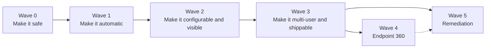

# VE Compliance Engine: Feature Roadmap (Post-Rewrite)

Document version: 1.0
Date: 28 September 2026
Companion to: `ROADMAP.md` (infrastructure phases), `CURRENT_PROGRESS_AND_FUTURE_GOALS.md`, `PROJECT_COMPLETE_GUIDE.md`
Scope: **application features and hardening** still to build in the Spring Boot + Next.js rewrite. Infrastructure scale-out (Redis, Kafka, Kubernetes, observability stack) stays in `ROADMAP.md` and is only referenced here where a feature depends on it.

---

## 1. How to read this document

Every item has an ID, a **Value** (1 to 5), an **Ease** (1 to 5, where 5 is easiest) and a **Priority score = Value x Ease**. Effort is a rough solo-developer estimate:

| Size | Meaning |
|---|---|
| XS | under half a day |
| S | about 1 day |
| M | 2 to 4 days |
| L | 1 to 2 weeks |
| XL | more than 2 weeks, build in stages |

The score ranks items, but it is not the only input. Two overrides are applied deliberately:

1. **Risk overrides score.** Anything that can change an endpoint (application remediation) is built last, however useful, and only after its safety prerequisites exist.
2. **Dependencies override score.** A feature that would break without another one (automatic rechecks without a worker pool) is scheduled after it.

The non-negotiable rule from the project plan still governs everything: `OBSERVATION -> EVIDENCE -> HUMAN REVIEW -> OPTIONAL ISE ACTION`. No item below may cause an ISE action as a side effect of collecting data.

---

## 2. Where the code stands today (findings that shape the plan)

These come from reading the current source, not from the older design documents.

| # | Finding | Where | Consequence |
|---|---|---|---|
| F1 | `enqueueIfDue` only checks for a `QUEUED`/`RUNNING` job. It never looks at the recheck interval, although its Javadoc says it does. | `JobService` | Nothing is ever rechecked on a timer. Posture runs only on reconnect or by hand. |
| F2 | The watcher only enqueues `POSTURE_CHECK`. `HARDWARE_CHECK` is never enqueued automatically. | `IseSessionWatcher` | Hardware data exists only when someone clicks. |
| F3 | `JobWorker.pollAndRun()` claims one job and blocks until it finishes (up to 60 to 70 s). | `JobWorker` | Throughput is roughly one endpoint per minute. Automatic rechecks would flood the queue on any fleet beyond a few dozen devices. |
| F4 | A job left `RUNNING` by a backend crash is never recovered. | `JobService` | Known gap, already listed as medium priority. |
| F5 | Required and blocked apps live in three places: agent parameter defaults, `InventoryController` constants, and the banner text in `applications/page.tsx`. `JobWorker` passes none of them. | agent, `InventoryController`, frontend | Policy can drift silently. |
| F6 | `endpoint_inventory` stores the full app list and top processes on every posture run, forever. | `PostureIngestService`, V12 | Fastest-growing table once rechecks are automatic. |
| F7 | Dev secrets are defaulted in `application.yml` (JWT secret, seed admin password, agent API key, ISE credentials) and appear in `run.ps1`. | `application.yml`, `run.ps1` | Fine on a laptop, unsafe if the app is ever started elsewhere without overrides. |
| F8 | The backend depends on `powershell.exe` with CIM/DCOM and DPAPI credentials. | `JobWorker`, agents | The backend cannot simply be put in a Linux container. See C3. |
| F9 | ~~Resolved~~ — `DashboardService`/`DashboardController` now provide `/api/v1/dashboard/summary`, `/trend`, `/categories`; the empty `EndpointSummaryResponse.java` placeholder has been deleted. | backend | Overview and compliance pages should be pointed at these instead of the browser-side fleet-call computation, if they aren't already. |
| F10 | Session log rows are written, and `findByEndpointIdOrderByEventAtDesc` exists, but no controller exposes it. | `EndpointSessionLogRepository` | Near-free feature. |
| F11 | Disconnect is declared after a single missed poll. | `IseSessionWatcher` | Roaming or a brief ISE blip flaps state and triggers extra rechecks. |
| F12 | Documentation drift: `PROJECT_COMPLETE_GUIDE.md` says Next 14 and Spring Boot 3.5.6; the repo has Next 16 and 3.5.16. Root `README.md` still lists plain HTML/Chart.js as the frontend. Empty legacy files remain. | docs, repo root | Confuses new readers. |

---

## 3. Master backlog (ranked)

### 3.1 Hardening and correctness

| ID | Item | Value | Ease | Score | Effort |
|---|---|---|---|---|---|
| H1 | Fail fast on default secrets (no defaults outside a `dev` profile) | 5 | 5 | 25 | XS |
| H2 | Stale `RUNNING` job recovery sweep | 4 | 5 | 20 | S |
| H3 | Test baseline (scorers, `overallStatus`, MAC normalization, job claim, security filters) | 4 | 3 | 12 | M |
| H4 | Documentation and repo cleanup | 2 | 5 | 10 | XS |
| H5 | Data retention for `endpoint_inventory` | 3 | 3 | 9 | S |

### 3.2 Automation and scale of the existing pipeline

| ID | Item | Value | Ease | Score | Effort |
|---|---|---|---|---|---|
| A1 | Worker pool for `JobWorker` (N parallel jobs) | 5 | 4 | 20 | S |
| A2 | Automatic rechecks: posture 4 h, hardware 24 h, with backoff | 5 | 4 | 20 | M |
| A3 | Disconnect grace period (2 missed polls) | 3 | 4 | 12 | S |

### 3.3 Visibility features

| ID | Item | Value | Ease | Score | Effort |
|---|---|---|---|---|---|
| V1 | Session history endpoint and tab | 2 | 5 | 10 | XS |
| V2 | Dashboard summary, trend and category APIs | 4 | 3 | 12 | M |
| V3 | System Health page | 3 | 4 | 12 | S |
| V4 | Hardware trend charts | 2 | 4 | 8 | S |
| V5 | ISE Actions page (fleet-wide restriction state) | 3 | 3 | 9 | S to M |
| V6 | Warranty data source (CSV first) | 2 | 3 | 6 | M |

### 3.4 Configuration and access control

| ID | Item | Value | Ease | Score | Effort |
|---|---|---|---|---|---|
| P1 | Policy management (required/blocked apps in the database) | 5 | 3 | 15 | M |
| C1 | RBAC (Admin, Analyst, Operator, Viewer) | 5 | 3 | 15 | M |
| C2 | Login rate limiting and lockout | 3 | 4 | 12 | S |

### 3.5 Delivery

| ID | Item | Value | Ease | Score | Effort |
|---|---|---|---|---|---|
| C3 | Containerization (staged, see note) | 3 | 2 | 6 | M to L |
| C4 | CI extension: tests, image build, push | 3 | 3 | 9 | S |
| C5 | Micrometer metrics (`/actuator/prometheus`) | 2 | 4 | 8 | S |

### 3.6 New capability

| ID | Item | Value | Ease | Score | Effort |
|---|---|---|---|---|---|
| E1 | Endpoint 360: on-demand diagnostics (ping, DNS, TCP 443, traceroute) | 3 | 3 | 9 | M |
| E2 | Endpoint 360: security indicators (lateral movement, beaconing) | 3 | 1 | 3 | L |
| R1 | Remediation stage 1: application classification (read-only) | 4 | 2 | 8 | M |
| R2 | Remediation stage 2: uninstall in dry-run mode | 4 | 1 | 4 | M |
| R3 | Remediation stage 3: real uninstall with guards | 4 | 1 | 4 | L |

---

## 4. Delivery waves

Each wave is independently shippable. Do not start the next wave until the previous wave's "done when" checks pass.

### Wave 0: Make it safe (about 1 week)

**Items:** H1, H2, H4, V1, start H3.

**Why first:** all cheap, all remove known traps, and H2 is a prerequisite for trusting anything automatic.

- **H1 Fail fast on default secrets.** Move the current defaults into an `application-dev.yml` profile. In the default profile, `app.jwt.secret`, `app.seed-admin.password` and `app.posture.api-key` have no default, so startup fails loudly if unset. Also remove real-looking credentials from `run.ps1` and read them from environment variables.
- **H2 Stale job recovery.** A `@Scheduled` sweep (every minute) finds jobs in `RUNNING` where `started_at` is older than `process-timeout-seconds` plus a margin, and calls `markFailed` with a "recovered after stall" reason. Also run once at startup. Since `markFailed` already handles retry and backoff, this is about 30 lines. Write the same failure evidence row `JobWorker.fail()` writes so the trail stays complete.
- **H4 Cleanup — done.** The empty `EndpointSummaryResponse.java` placeholder is deleted (V2 below already superseded it); `pending_devices.txt`, `seen_macs.txt`, `ip_mac_map.txt` were never actually tracked in this repo. Remaining: fix the version/stack statements in `README.md` and `PROJECT_COMPLETE_GUIDE.md`, and note the harmless V4→V8 migration numbering gap there.
- **V1 Session history.** Add `GET /api/v1/endpoints/{id}/sessions` returning the existing repository query, and a "Sessions" tab on the endpoint detail page.
- **H3 (start).** Unit tests for the four scorers, `HardwareHealthService.bandFor`, `PostureIngestService.overallStatus` (including the ordinal-order rule), and `EndpointService.normalizeMac`. These need no database.

**Done when:** the app refuses to start on default secrets outside `dev`; killing the backend mid-job and restarting returns the job to `QUEUED`; the repo root has no leftover prototype files.

### Wave 1: Make it automatic (about 2 weeks)

**Items:** A1, A2, A3, V2. Finish H3 (Testcontainers test for the claim query).

**Order matters: A1 before A2.** F3 shows one worker handles about one endpoint a minute. Turning on timers first would bury manual jobs behind a backlog.

- **A1 Worker pool.** Replace the single blocking tick with N worker threads (`app.jobs.worker-threads`, default 4). `FOR UPDATE SKIP LOCKED` already makes concurrent claiming safe; no schema change. Keep each thread's loop as claim, dispatch, repeat, and sleep only when the queue is empty. Cap N by what the host can bear, since each job starts a `powershell.exe`. Add a `priority` convention: manual jobs `10`, automatic `0`, so a person clicking "Check Posture" is never stuck behind the fleet sweep.
- **A2 Automatic rechecks.** New `RecheckScheduler` running every few minutes:
  - Posture: for every **connected** endpoint whose last completed posture job (or latest assessment) is older than `app.jobs.recheck.posture-hours` (default 4) or missing, call `enqueueIfDue`.
  - Hardware: same with `hardware-hours` (default 24), **only for endpoints that have had at least one successful posture run** (the Python version used this as a proxy for "reachable Windows box"), plus failure backoff.
  - Fix `enqueueIfDue` to take the interval and check the last `COMPLETE` job of that type. Backoff for hardware is derived from the last `FAILED` job's `completed_at`, not from in-memory state, so it survives restarts (an improvement over the Python dict).
  - Disconnected endpoints are never auto-queued; they keep their last known data.
- **A3 Grace period.** Track consecutive missed polls per MAC (in-memory map is enough at this stage) and mark disconnected only after 2 (`app.ise.disconnect-grace-polls`). Resolves open question 8 in the project plan.
- **V2 Dashboard APIs — done.** `DashboardService`/`DashboardController` already implement:
  - `GET /api/v1/dashboard/summary`: counts of connected, not connected, compliant, non-compliant, error, unassessed, and a **stale** count (last assessment older than 2x the recheck interval).
  - `GET /api/v1/dashboard/trend?days=7`: daily compliant percentage from `assessment`.
  - `GET /api/v1/dashboard/categories`: pass rate per `check_type` from `check_result`.
  - Index note: the existing `idx_assessment_endpoint_created` serves per-endpoint queries; the trend query groups by day, so add an index on `assessment(created_at)` if it is slow.
  - Point `overview/page.tsx` and `compliance/page.tsx` at these instead of computing in the browser. `TrendChart` and `StatusDonut` already exist.

**Done when:** with 10 or more connected endpoints, posture and hardware refresh on their own; a manual check runs within seconds even while a sweep is queued; the overview loads from one summary call.

### Wave 2: Make it configurable and visible (about 2 weeks)

**Items:** P1, V3, V5, V4, H5, H3 continued.

- **P1 Policy management.** New tables `app_policy` (id, name, version, active, created_by, created_at) and `app_policy_rule` (policy_id, app_pattern, rule_type `REQUIRED` or `BLOCKED`). One active policy at a time to start (the project's own rule: generalize only when a second real policy exists).
  - `JobWorker` reads the active policy and passes it to the agent. **Gotcha:** with `powershell -File`, comma-separated values arrive as one string, not an array. Pass a single delimited string or a JSON string and split it inside the script.
  - Record the **policy version** inside each `APPLICATIONS` check's `details`, so old assessments remain explainable after the policy changes.
  - `InventoryController` and the applications page read the same policy, removing the three-way duplication (F5).
  - UI: a Policies page (Admin only once C1 exists). Editing a policy writes an audit row.
- **V3 System Health page.** One backend endpoint `GET /api/v1/system/health` combining: database reachable, `IseLinkHealth` status, queue depth by status, age of the oldest `QUEUED` job, failed jobs in the last 24 h, last successful poll time, and worker-thread count. The sidebar widget already polls `/api/v1/endpoints` as a crude check; replace that with this.
- **V5 ISE Actions page.** There is no `enforcement_state` column in the Java schema, only the audit trail. Derive current state from the latest `RESTRICT` or `CLEAR_RESTRICTION` audit row per endpoint (one `DISTINCT ON` query, same pattern as the other "latest" queries). Show a fleet table with a state badge and last action. Be explicit in the UI that under `ATTRIBUTE` mode "Clear" is informational (it tells the operator to re-share posture), so the badge cannot claim "unrestricted" from that mode.
- **V4 Hardware trend charts.** `GET .../hardware-health` already returns history. Feed successful runs into `TrendChart` for overall score, and one line per component.
- **H5 Retention.** Decide and document the rule, then implement a nightly job. Recommended: keep `assessment` and `check_result` forever (they are the evidence), but keep full `endpoint_inventory` payloads only for the latest N runs per endpoint (for example 10) and null out the JSONB columns on older rows so the row and its timestamp remain. Measure table size first (the test laptop alone reports about 95 apps per run) and set N from that.

**Done when:** changing the blocked list in the UI changes the next posture result without a redeploy; System Health shows queue depth and ISE state; inventory table size is bounded.

### Wave 3: Make it multi-user and shippable (about 2 to 3 weeks)

**Items:** C1, C2, C4, C5, V6, C3 (staged).

- **C1 RBAC.** `Role` today has one value and `app_user.role` is already a plain text column, so **no schema change** is needed to add roles.
  - Roles: `ADMIN` (users, policy, everything), `OPERATOR` (share, restrict, clear, enqueue), `ANALYST` (read plus enqueue, plus share posture), `VIEWER` (read only).
  - Enforce with `@EnableMethodSecurity` and `@PreAuthorize` on controllers; keep `ROLE_AGENT` untouched and limited to the two ingestion routes.
  - `IseActionAudit.operator` already records the JWT subject; add the role to the audit detail for context.
  - Add a small user-management API and page (Admin only): create, disable, change role, reset password.
  - Frontend: hide or disable buttons by role using the role already stored by `setCurrentUser`. Hiding is convenience only; the backend check is the control.
- **C2 Login rate limiting.** Add `failed_attempts` and `locked_until` to `app_user` (new migration). Lock for a few minutes after 5 failures, and keep the existing identical `401` body so usernames are not revealed. Log lockouts. A per-IP limiter (Bucket4j) can be layered on top; a shared store (Redis) is only needed when there is more than one backend instance.
- **C4 CI.** Extend `ci.yml`: the backend already runs `mvn verify` against a Postgres service, so once H3 adds tests they run automatically. Add image build and push to GHCR after C3, and a frontend `next build` step.
- **C5 Metrics.** Add `micrometer-registry-prometheus`, expose `/actuator/prometheus` (restricted), and publish gauges for queue depth and oldest queued age. Costs little now and feeds the observability phase later.
- **V6 Warranty (CSV first).** Table `warranty_record` (serial_number, vendor, expires_on, source). Admin uploads a CSV from the ITAM export; the ingest service fills `warranty_status` and `warranty_days_remaining` by serial number. An OEM API is a separate, later item. Resolves open question 10 in the least risky way.
- **C3 Containerization: do it in stages, because of F8.**
  1. Stage A (easy): frontend image (`output: 'standalone'`) and the existing Postgres compose.
  2. Stage B (hard): the backend launches `powershell.exe` and relies on Windows CIM/DCOM and DPAPI-protected credentials. A Linux container cannot do that reliably. Realistic options: keep the backend on a Windows host and containerize only the rest; use Windows containers; or, when the Kafka phase arrives, split out a Windows **dispatcher** service that runs the agents while the API runs anywhere. Decide this before writing a backend Dockerfile so time is not spent on an image that cannot run its checks.

**Done when:** a Viewer cannot restrict an endpoint (verified by test, not just by hidden buttons); five wrong passwords lock the account; CI runs tests on every push; the frontend runs from an image.

### Wave 4: Endpoint 360 (about 2 to 3 weeks)

The Python version ran experience and security collectors on the console's own machine, plus an on-demand diagnostic against a chosen endpoint. Only the second idea maps cleanly onto an agentless, per-endpoint design.

- **E1 On-demand diagnostics (M).** New job type `DIAGNOSTIC_CHECK` and table `endpoint_diagnostic` (endpoint_id, job_id, results JSONB, collected_at, succeeded, error). Reuse the job queue, worker, timeout backstop and RESULT_JSON contract unchanged.
  - Decide where the probes run. Running them from the backend measures the path from the backend, which is not the user's experience. Running them **on the endpoint** through an `Invoke-Command` session (already used as a fallback in `posture_agent.ps1`) measures what the endpoint sees: gateway ping, DNS resolution, TCP 443 connect time, and traceroute. This needs WinRM on the target, so record "WinRM unavailable" as a distinct, non-failing result.
  - Score with a small transparent deduction model (as in the Python version) and store the score and the raw results, mirroring how hardware health keeps `raw_report`.
  - Add a "Diagnostics" tab to the endpoint page and a "Run diagnostics" button.
- **E2 Security indicators (L, lowest ease).** Lateral movement and beaconing detection need **repeated snapshots of established connections** over time, then heuristics (fan-out on SMB, RPC, RDP, WinRM, SSH; periodicity across snapshots). The current agent collects only listening ports. Points to settle first:
  - Remote sampling cost: several CIM round trips per endpoint over a window makes each job long. It probably needs its own job type with a longer timeout and its own worker slot.
  - False positives: label results "possible" and keep them evidence-only. They may inform an operator's decision to restrict, but must never trigger it. This is the observation-versus-enforcement rule in practice.
  - Build only after E1 proves the diagnostic job pattern.

**Explicitly out of scope:** browser-history collection stays deferred pending legal and HR sign-off (project plan, question 9).

### Wave 5: Application remediation (last, staged, about 3+ weeks)

This is the only feature that changes an endpoint, so it carries the strictest gate. Build it as three separately shipped stages, each usable on its own.

**Hard prerequisites (do not start without all of these):** C1 RBAC with a dedicated `REMEDIATOR` permission, P1 policy management, H2 stale-job recovery, A1 worker pool, H3 tests, and a working audit pattern (already proven by `ise_action_audit`).

- **R1 Classification, read-only (M).** Tables `app_classification` (app_key, category `BUSINESS_RELEVANT` / `IRRELEVANT` / `REVIEW`, protected flag) and `remediation_audit` (from the design docs' V9 reservation). Build **one** normalization function for `app_key` (trim, collapse internal whitespace, lowercase) and use it at every read and write. The Python version had a real bug where two places normalized differently and left stale rows. Add a fleet-wide "applications" view that shows classification and how many endpoints have each app. Nothing can be uninstalled yet.
- **R2 Uninstall in dry-run mode (M).** New job type `UNINSTALL_APP` that connects, resolves the uninstall command from the registry, and **reports what it would run** without running it. The result is stored and audited. This proves credentials, targeting and the protected list against real machines with zero risk.
- **R3 Real uninstall (L).** Only after R2 has run cleanly across the fleet:
  - Server-side `PROTECTED_KEYWORDS` guard (Windows components, drivers, security agents, Cisco Secure Client). The check lives in the backend service, not just the UI, and refuses regardless of the caller.
  - Feature flag `app.remediation.enabled`, default `false`.
  - Typed confirmation in the UI (type the hostname), one application per request, a per-endpoint rate cap, and a mandatory `remediation_audit` row for success and failure.
  - After completion, enqueue a posture recheck so the result is verified, not assumed.
  - No automatic triggering from posture results, ever. A person selects the app and confirms.

---

## 5. Requirement matrix

| Item | Needs first | New tables or migrations | New job type | Touches agent script | Needs live ISE / endpoint to test |
|---|---|---|---|---|---|
| H1, H2, H4, V1 | none | none | no | no | no |
| A1 | none | none | no | no | no (fake agent works) |
| A2 | A1, H2 | none | no | no | partly |
| A3 | none | none | no | no | ISE for full test |
| V2 | none | index only | no | no | no |
| P1 | none | 2 tables | no | small (accept policy string) | endpoint for end-to-end |
| V3, V4 | A1 (V3 queue stats) | none | no | no | no |
| V5 | none | none | no | no | ISE |
| H5 | V2 | none | no | no | no |
| C1 | H3 | none (role is text) | no | no | no |
| C2 | none | 2 columns | no | no | no |
| V6 | none | 1 table | no | no | no |
| E1 | A1 | 1 table | yes | new script | endpoint |
| E2 | E1 | 1 table | yes | new script | endpoint |
| R1 | C1, P1 | 2 tables | no | no | no |
| R2, R3 | R1, C1, H2, A1 | uses R1 tables | yes | new script | endpoint (lab only first) |

---

## 6. Mapping to the original feature list

| Original list item | Roadmap ID(s) | Wave |
|---|---|---|
| Application remediation | R1, R2, R3 | 5 |
| Endpoint 360 | E1, E2 | 4 |
| Dashboard summary, trend, category APIs | V2 | 1 |
| Automatic rechecks | A1, A2 | 1 |
| Stale `RUNNING` recovery | H2 | 0 |
| Policy management | P1 | 2 |
| Session history, ISE Actions page, System Health page | V1, V5, V3 | 0, 2, 2 |
| Warranty data source, hardware trend charts | V6, V4 | 3, 2 |
| RBAC, login rate limiting, containerization | C1, C2, C3 | 3 |
| Added by this review | H1, H3, H4, H5, A3, C4, C5 | 0 to 3 |

---

## 7. Decisions needed from the owner

| # | Decision | Needed by | Suggested default |
|---|---|---|---|
| D1 | Recheck intervals (posture 4 h, hardware 24 h) and backoff length | Wave 1 | Keep the Python values, make them config |
| D2 | Disconnect grace: 1 or 2 missed polls | Wave 1 | 2 |
| D3 | Inventory retention (latest N runs) | Wave 2 | N = 10, evidence tables kept forever |
| D4 | Hardware score bands (85/70/50) confirmed for real fleet | Wave 2 | Keep, but show band thresholds in the UI |
| D5 | Which roles exist on day one | Wave 3 | The four listed in C1 |
| D6 | Warranty source: CSV export, OEM API, or skip | Wave 3 | CSV |
| D7 | Backend hosting: Windows host, Windows containers, or dispatcher split | Wave 3 | Windows host now, dispatcher split later |
| D8 | Where Endpoint 360 probes run (backend vs endpoint) | Wave 4 | On the endpoint via WinRM |
| D9 | Scale target for the first release (pilot vs 40,000 endpoints) | Wave 1 | Pilot; revisit before Wave 3 |

---

## 8. Risks

| Risk | Where it bites | Mitigation |
|---|---|---|
| Automatic rechecks overload endpoints or the host | A2 | A1 first, config caps, jitter on the sweep, manual priority above automatic |
| Stored common admin credential is powerful and tied to one Windows account | every agent job, worst for R3 | Keep DPAPI file git-ignored; document the account; consider a least-privilege service account before R3 |
| Policy change silently alters old results | P1 | Store policy version in each check's details |
| RBAC only enforced in the UI | C1 | Backend `@PreAuthorize` plus tests that call the API directly as each role |
| Remediation removes the wrong software | R3 | Server-side protected list, dry-run first, typed confirmation, feature flag off by default |
| Table growth from inventory | H5 | Retention job before enabling A2 in production |
| Wrong "unrestricted" claim after Clear in ATTRIBUTE mode | V5 | Show state as "cleared requested", not "unrestricted", in that mode |

---

## 9. Suggested first 10 working days

| Day | Work |
|---|---|
| 1 | H1 (secrets), H4 (cleanup), V1 (session history) |
| 2 | H2 (stale job recovery) |
| 3 to 4 | H3 unit tests (scorers, status ordering, MAC normalization) |
| 5 to 6 | A1 worker pool, verify with several queued jobs |
| 7 to 8 | A2 recheck scheduler and fixed `enqueueIfDue` |
| 9 | A3 grace period |
| 10 | Start V2 (summary endpoint first; charts after) |

After day 10 the platform refreshes itself, survives restarts, and has a test base, which is the foundation every later wave assumes.

---

## 10. Deliberately not planned

- Automatic enforcement of any kind (removed by design, not deferred).
- pxGrid transport (stays inert until persona and client certificates exist).
- Browser-history collection (pending legal and HR sign-off).
- Redis, Kafka, Kubernetes, Prometheus stack: tracked in `ROADMAP.md` phases 4 to 9 and only pulled forward when a wave above demonstrates the specific problem they solve (for example a second backend instance for login limiting, or the dispatcher split for containerizing the backend).

---

*Update the scores, wave assignments and decision table as items land, so this document stays a description of the plan rather than of the past.*
