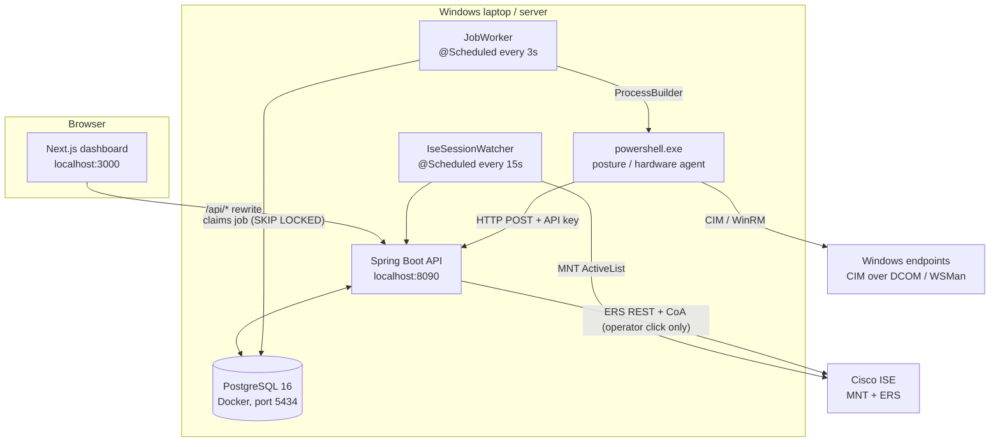

# VE Compliance Engine (Endpoint Posture) — Complete Project Guide

**Scope:** the whole system, front end to back end, the full runtime flow, and every file in the repository.
**Written from:** the actual source code in the repository as of 24 September 2026 (not from the older design documents, which are compared against the code in section 16).
**Status of the code:** Spring Boot backend and PowerShell agents are built and were verified against a real Windows laptop and a real Cisco ISE. The Next.js frontend is built and running; several pages are still being polished.

## Contents

1. [What the system is](#1-what-the-system-is)
2. [Architecture](#2-architecture)
3. [Technology stack](#3-technology-stack)
4. [Repository layout](#4-repository-layout)
5. [End-to-end flows](#5-end-to-end-flows)
6. [Database](#6-database)
7. [Backend: every package and file](#7-backend-every-package-and-file)
8. [REST API reference](#8-rest-api-reference)
9. [Configuration reference](#9-configuration-reference)
10. [PowerShell agents](#10-powershell-agents)
11. [Frontend: every folder and file](#11-frontend-every-folder-and-file)
12. [Infrastructure, CI and tooling](#12-infrastructure-ci-and-tooling)
13. [Running the project](#13-running-the-project)
14. [Security model](#14-security-model)
15. [Known issues and observations](#15-known-issues-and-observations)
16. [Where older documents disagree with the code](#16-where-older-documents-disagree-with-the-code)

---

## 1. What the system is

An **agentless endpoint posture and compliance platform** that works alongside **Cisco ISE**.

- It discovers which devices are on the network by polling ISE for active sessions.
- It checks Windows devices remotely (PowerShell over CIM, using DCOM or WSMan) without installing an agent on them.
- It stores every result as permanent, append-only history in PostgreSQL.
- It shows the results in a web dashboard.
- A human operator can then choose to **share** a device's posture with ISE, **restrict** it, or **clear** a restriction.

### The rule everything else obeys

```
OBSERVATION  ->  EVIDENCE  ->  HUMAN REVIEW  ->  OPTIONAL ISE ACTION
```

Cisco ISE stays the only network-enforcement authority. Recording a posture result **never** calls ISE. Share, Restrict and Clear are three separate buttons, handled by a separate controller and service, and each one writes an audit row whether it succeeds or fails. This is enforced by the code structure (separate classes), not just by convention.

### Two independent facts per device

| Fact | Meaning | Where it lives |
|---|---|---|
| **Connected** | ISE currently reports an active session for this MAC | `endpoint.connected` |
| **Posture status** | Result of the latest check: `COMPLIANT`, `NON_COMPLIANT` or `ERROR` | latest row in `assessment` |

A device can be connected with an old posture result, or disconnected with a good historical one. The UI never merges the two.

---

## 2. Architecture



**Modular monolith.** One Spring Boot application with packages `security`, `endpoint`, `job`, `posture`, `hardware`, `ise`, `session`, `audit`. There is no message broker and no Redis yet; the job queue is a PostgreSQL table.

**Two ways to authenticate to the API**

| Caller | Credential | Allowed to |
|---|---|---|
| Dashboard user | `Authorization: Bearer <JWT>` from `/api/v1/auth/login` | everything |
| PowerShell agent | header `X-Posture-Api-Key: <shared secret>` | only `POST /api/v1/posture` and `POST /api/v1/hardware-health` |

---

## 3. Technology stack

| Layer | Technology | Version / detail |
|---|---|---|
| Backend language | Java | 21 |
| Backend framework | Spring Boot | 3.5.6 (web, validation, data-jpa, security, actuator) |
| Persistence | Hibernate/JPA + PostgreSQL | `ddl-auto: validate`; schema owned by Flyway |
| Migrations | Flyway (`flyway-core`, `flyway-database-postgresql`) | files in `db/migration` |
| Auth | Spring Security + JJWT | JJWT 0.12.6, HMAC-SHA256 tokens, 480-minute lifetime |
| API docs | springdoc-openapi | 2.8.6; Swagger UI at `/swagger-ui.html` |
| Boilerplate | Lombok | entities only |
| Build | Maven | `spring-boot-maven-plugin` forces `-Duser.timezone=UTC`; `maven-javadoc-plugin` 3.10.1 runs at `package` |
| Collectors | PowerShell 5+ | CIM, WinRM/DCOM, DPAPI credential |
| Frontend | Next.js 14.2.32 (App Router), React 18.3, TypeScript 5.5 | |
| Styling | Tailwind CSS 3.4 + CSS variables | dark default, light via `.light` class |
| Icons | lucide-react | |
| Database container | `postgres:16` and `adminer:4` | docker-compose |
| CI | GitHub Actions | Ubuntu 24.04, JDK 21 (Temurin), Node 22 |

---

## 4. Repository layout

```
endpoint-posture-java/
├── README.md
├── ROADMAP.md
├── SYSTEM_OVERVIEW.md
├── CURRENT_PROGRESS_AND_FUTURE_GOALS.md
├── FUTURE_CHANGES_SESSIONS_AND_OVERVIEW.md
├── VE_Compliance_Engine_Full_Documentation.md
├── VE_Compliance_Engine_HLD_LLD_Complete.md
├── docker-compose.yml
├── .gitignore
├── .vscode/settings.json
├── .github/
│   ├── workflows/ci.yml
│   └── modernize/java-upgrade/
│       ├── .gitignore
│       └── hooks/scripts/recordToolUse.sh, recordToolUse.ps1
├── scripts/                              # PowerShell agents (run by the backend)
│   ├── posture_agent.ps1
│   ├── hardware_health_agent.ps1
│   └── Save-PostureCredential.ps1
├── backend/
│   ├── pom.xml
│   ├── run.ps1
│   └── src/main/
│       ├── resources/
│       │   ├── application.yml
│       │   └── db/migration/V1 ... V11 (*.sql)
│       └── java/com/endpointposture/
│           ├── EndpointPostureApplication.java
│           ├── config/    security/   endpoint/   job/
│           ├── posture/   hardware/   ise/        session/   audit/
└── frontend/
    ├── package.json, package-lock.json, tsconfig.json
    ├── tailwind.config.ts, postcss.config.mjs, next.config.mjs
    ├── global.d.ts, .env.local.example
    ├── app/        (layout, globals.css, login, (dashboard)/...)
    ├── components/ (layout, ui, dashboard)
    └── lib/        (api, auth, session, hooks, csv, inventory)
```

Files that exist in the project workspace but are not part of the running application:

| File | What it is |
|---|---|
| `pending_devices.txt` | Empty. Leftover from the Python prototype's flat-file queue. Replaced by the `posture_job` table. |
| `EndpointSummaryResponse.java` (twice) | Empty files (one at repo root, one under `endpoint/dto/`). Placeholder for a dashboard summary DTO that was never written. |
| `conversations_` | Exported chat history used as project context. |
| `posture_common_cred.xml` | Created at runtime by `Save-PostureCredential.ps1`. Deliberately git-ignored. |

---
