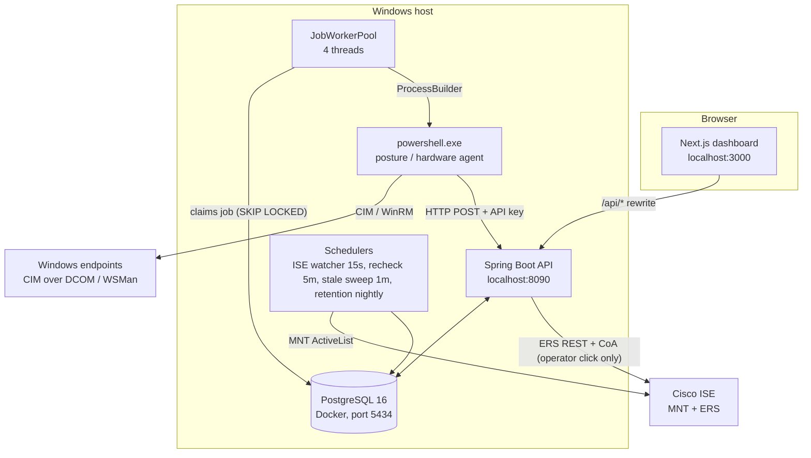

# VE Compliance Engine (Endpoint Posture): Complete Project Guide

**Scope:** the whole system, front end to back end, the runtime flow, and every package in the repository.
**Written from:** the source code as of 30 September 2026. Where an older document disagrees with the code, the code wins (see section 16).
**Status:** the Spring Boot backend, PowerShell agents and Next.js dashboard are built, including role-based access control, application policy management, automatic rechecks and system health. The backend and agents were verified against a real Windows laptop and a real Cisco ISE.

## Contents

1. [What the system is](#1-what-the-system-is)
2. [Architecture](#2-architecture)
3. [Technology stack](#3-technology-stack)
4. [Repository layout](#4-repository-layout)
5. [End-to-end flows](#5-end-to-end-flows)
6. [Database](#6-database)
7. [Backend: every package](#7-backend-every-package)
8. [REST API reference](#8-rest-api-reference)
9. [Configuration reference](#9-configuration-reference)
10. [PowerShell agents](#10-powershell-agents)
11. [Frontend](#11-frontend)
12. [Infrastructure, CI and tooling](#12-infrastructure-ci-and-tooling)
13. [Running the project](#13-running-the-project)
14. [Security model](#14-security-model)
15. [Known issues and what is left](#15-known-issues-and-what-is-left)
16. [Superseded documents and what they got wrong](#16-superseded-documents-and-what-they-got-wrong)

---

## 1. What the system is

An **agentless endpoint posture and compliance platform** that works alongside **Cisco ISE**.

- It discovers which devices are on the network by polling ISE for active sessions.
- It checks Windows devices remotely (PowerShell over CIM, DCOM or WSMan) with nothing installed on them.
- It stores every result as permanent, append-only history in PostgreSQL.
- It shows results in a web dashboard.
- A human operator can **share** a device's posture with ISE, **restrict** it, or **clear** a restriction, subject to their role.

### The rule everything else obeys

```
OBSERVATION -> EVIDENCE -> HUMAN REVIEW -> OPTIONAL ISE ACTION
```

Cisco ISE is the only network-enforcement authority. Recording a posture result never calls ISE. Share, Restrict and Clear are three separate operator actions handled by their own controller and service, and each writes an audit row whether it succeeds or fails. This is enforced by class boundaries, not just convention.

### Two independent facts per device

| Fact | Meaning | Where it lives |
|---|---|---|
| **Connected** | ISE currently reports an active session for this MAC | `endpoint.connected` |
| **Posture status** | Latest check result: `COMPLIANT`, `NON_COMPLIANT` or `ERROR` | newest row in `assessment` |

A device can be connected with old posture, or disconnected with a good historical result. The UI never merges the two. The dashboard KPIs (Command Center and Compliance Matrix pass rates) count **connected devices only**; tables still list every device with its last known result.

---

## 2. Architecture


```mermaid
flowchart TD
    subgraph Browser
        FE["Next.js dashboard<br/>localhost:3000"]
    end
    subgraph Host["Windows host"]
        API["Spring Boot API<br/>localhost:8090"]
        POOL["JobWorkerPool<br/>4 threads"]
        SCHED["Schedulers<br/>ISE watcher 15s, recheck 5m, stale sweep 1m, retention nightly"]
        PS["powershell.exe<br/>posture / hardware agent"]
        DB[("PostgreSQL 16<br/>Docker, port 5434")]
    end
    ISE["Cisco ISE<br/>MNT + ERS"]
    EP["Windows endpoints<br/>CIM over DCOM / WSMan"]

    FE -- "/api/* rewrite" --> API
    API <--> DB
    SCHED -- "MNT ActiveList" --> ISE
    SCHED --> DB
    POOL -- "claims job (SKIP LOCKED)" --> DB
    POOL -- "ProcessBuilder" --> PS
    PS -- "CIM / WinRM" --> EP
    PS -- "HTTP POST + API key" --> API
    API -- "ERS REST + CoA (operator click only)" --> ISE
```

**Modular monolith.** One Spring Boot application. No message broker and no Redis; the job queue is a PostgreSQL table.

**Two ways to authenticate**

| Caller | Credential | Allowed to |
|---|---|---|
| Dashboard user | `Authorization: Bearer <JWT>` from `/api/v1/auth/login` | depends on role, see the matrix in section 14 |
| PowerShell agent | header `X-Posture-Api-Key` | only `POST /api/v1/posture` and `POST /api/v1/hardware-health` |

---

## 3. Technology stack

| Layer | Technology | Detail |
|---|---|---|
| Backend | Java 21, Spring Boot 3.5.16 | web, validation, data-jpa, security, actuator |
| Persistence | Hibernate/JPA + PostgreSQL 16 | `ddl-auto: validate`; Flyway owns the schema |
| Auth | Spring Security + JJWT 0.12.6 | HMAC-SHA256, 480-minute tokens, BCrypt passwords, method security (`@PreAuthorize`) |
| API docs | springdoc-openapi 2.8.15 | Swagger UI at `/swagger-ui.html` |
| Boilerplate | Lombok | entities only |
| Build | Maven | surefire and boot plugin force `-Duser.timezone=UTC`; javadoc plugin is manual (`mvn javadoc:javadoc`) |
| Tests | JUnit 5, Mockito, Spring Security Test, Testcontainers 1.20.4 | several tests need Docker |
| Collectors | PowerShell 5+ | CIM, WinRM/DCOM, DPAPI credential |
| Frontend | Next.js 16.3, React 19, TypeScript 5.9 | App Router |
| Styling | Tailwind CSS 3.4 + CSS variables | dark default, light via `.light` class set from a `theme` cookie |
| Icons | lucide-react 1.47 | |
| Containers | `postgres:16`, `adminer:4` | docker-compose |
| CI | GitHub Actions | Ubuntu 24.04, JDK 21, Node 22 |

---

## 4. Repository layout

```
endpoint-posture-java/
├── README.md, ROADMAP.md, FEATURE_ROADMAP.md, PROJECT_COMPLETE_GUIDE.md
├── docker-compose.yml, .gitignore
├── .github/workflows/ci.yml
├── scripts/                     # PowerShell agents run by the backend
│   ├── posture_agent.ps1
│   ├── hardware_health_agent.ps1
│   └── Save-PostureCredential.ps1
├── backend/
│   ├── pom.xml
│   ├── run.ps1                  # RBAC smoke test: creates one user per role and tries actions
│   ├── start-dev.ps1            # starts the backend with the dev profile
│   └── src/
│       ├── main/resources/
│       │   ├── application.yml, application-dev.yml (git-ignored)
│       │   └── db/migration/V1 ... V13
│       ├── main/java/com/endpointposture/
│       │   ├── EndpointPostureApplication.java
│       │   └── config/ security/ endpoint/ job/ posture/ hardware/
│       │       ise/ session/ audit/ inventory/ dashboard/ policy/ system/
│       └── test/java/...
└── frontend/
    ├── package.json, tsconfig.json, tailwind.config.ts, next.config.mjs
    ├── app/         layout, globals.css, login, (dashboard)/...
    ├── components/  layout, ui, dashboard
    └── lib/         api, auth, permissions, session, csv, inventory, hooks, contexts
```

`posture_common_cred.xml` is created at runtime by `Save-PostureCredential.ps1`. It is DPAPI-encrypted, tied to one Windows account, and git-ignored.

---

## 5. End-to-end flows

### 5.1 Discovery
1. `IseSessionWatcher.tick()` runs every 15 s and asks `IseSessionClient` for ISE's MNT ActiveList.
2. The client returns a `SessionPoll(ok, sessions, error)`. **A failed poll is not the same as an empty poll.**
3. On failure the watcher records it in `IseLinkHealth` and changes nothing (state is frozen at last known values).
4. On success, each active MAC goes through `EndpointService.markConnected`. A device that was not connected before gets a `CONNECTED` row in `endpoint_session_log` and a posture job (`enqueueIfDue`), if it has an IP or hostname.
5. A connected endpoint missing from `app.ise.disconnect-grace-polls` (default 2) consecutive successful polls is marked disconnected and gets a `DISCONNECTED` log row.

### 5.2 Running a check
1. A job is enqueued by the watcher, by `RecheckScheduler`, or by an operator (`POST /api/v1/jobs`, priority 10 vs 0 for automatic; needs `ADMIN`, `OPERATOR` or `ANALYST`).
2. One of the `JobWorkerPool` threads calls `JobWorker.runOnce()`, which claims the next job with `FOR UPDATE SKIP LOCKED` and marks it `RUNNING`.
3. For a posture job the worker reads the **active application policy** and starts `posture_agent.ps1` with `-PolicyVersion`, `-RequiredAppsList`, `-BlockedAppsList` (delimited by `|`). The API key goes in the `POSTURE_API_KEY` environment variable, never the command line.
4. The agent collects data, POSTs its report to the backend, and always prints a `RESULT_JSON:` line.
5. `submitted: true` means the job is `COMPLETE`. Anything else writes failure evidence (an `ERROR` assessment, or a `succeeded=false` hardware row) and fails the job. Failed jobs return to `QUEUED` with backoff until `max_attempts` (3), then stay `FAILED`.
6. If the backend dies mid-job, `StaleJobRecoveryScheduler` (startup + every minute) fails jobs left `RUNNING` beyond the process timeout plus a margin, writing the same evidence.

### 5.3 Ingesting a report
`PostureIngestController` -> `PostureIngestService.ingest` in one transaction:
upsert endpoint by MAC -> update hardware identity -> compute overall status (worst of the reported status and every check, using `AssessmentStatus` ordinal order) -> save `assessment` + `check_result` rows -> save one `endpoint_inventory` row. Nothing here calls ISE.
Hardware reports go through `HardwareIngestController` -> `HardwareIngestService` (normalizes PowerShell's single-element-array quirk, scores components) -> `HardwareHealthService.recordReport`.

### 5.4 Automatic rechecks
`RecheckScheduler` sweeps every 5 min. For each **connected** endpoint with an IP or hostname, `JobService.enqueueIfDue(id, type, interval, failureBackoff)` queues a job only if none is `QUEUED`/`RUNNING`, the last `COMPLETE` job is older than the interval (posture 4 h, hardware 24 h), and the last job did not `FAIL` within the backoff (6 h). Hardware is only queued once the endpoint has at least one non-`ERROR` posture result. All timing comes from the database, so it survives restarts.

### 5.5 Operator actions
Endpoint detail page -> `ConfirmDialog` -> `IseActionController` (`/share`, `/restrict`, `/clear`) -> `IseActionService` -> `IseTransport` (`ErsIseTransport`). The service writes exactly one `ise_action_audit` row, success or failure, before returning. HTTP status is `200` on success and `502` if ISE rejected or failed the call. Share needs `ADMIN`, `OPERATOR` or `ANALYST`; restrict and clear need `ADMIN` or `OPERATOR`.

### 5.6 Retention
`InventoryRetentionScheduler` runs nightly (03:30). `InventoryRetentionService` keeps the full inventory payload for the newest N runs per endpoint (default 10) and sets the JSONB columns to `NULL` on older rows. The rows and their timestamps stay. Assessments and check results are never pruned.

---

## 6. Database

Schema is owned by Flyway (`backend/src/main/resources/db/migration`). Version numbers jump from V4 to V8; the gap is harmless. Every table uses UUID primary keys and real foreign keys.

| Migration | Table(s) | Purpose |
|---|---|---|
| V1 | `app_user` | login users; `role` is plain text (`ADMIN`, `OPERATOR`, `ANALYST`, `VIEWER`), `enabled` flag |
| V2 | `endpoint` | device master row; `mac_address` unique business key; `connected`, session timestamps, hardware identity |
| V3 | `posture_job` | the queue: type, status, priority, attempts, `next_attempt_at`, error |
| V4 | `assessment`, `check_result` | append-only posture history; `check_result.details` is JSONB with a GIN index |
| V8 | `hardware_health`, `hardware_recommendation` | scores 0-100 with CHECK constraints, band, raw report JSONB |
| V9 | (alters `hardware_health`) | scores nullable; adds `succeeded`, `error_message` so failed runs leave evidence |
| V10 | `endpoint_session_log` | connect/disconnect event log |
| V11 | `ise_action_audit` | one row per Share/Restrict/Clear attempt |
| V12 | `endpoint_inventory` | per-run raw ports, apps, processes, resource usage (JSONB) |
| V13 | `app_policy`, `app_policy_rule` | versioned required/blocked apps; a partial unique index allows only one active policy; version 1 is seeded |
| V14 | (alters `app_user`) | adds `failed_attempts` and `locked_until` for brute-force protection |

**Foreign-key rules.** `ON DELETE CASCADE` where a child is meaningless without its parent (`check_result`, `posture_job`, session log, audit). `ON DELETE SET NULL` for `job_id` on `assessment`/`hardware_health` and `assessment_id` on `endpoint_inventory`, so evidence outlives a purged job.

**Users are not foreign keys.** `ise_action_audit.operator` and `app_policy.created_by` store the username as text, so deleting a user keeps the history.

**Append-only.** Assessments, check results, hardware reports, inventory, session log and audit rows are inserted, never updated (inventory payloads are only nulled by retention). Only `endpoint`, `posture_job`, `app_user` and `app_policy.active` change in place.

**Latest-per-endpoint queries** use Postgres `SELECT DISTINCT ON (endpoint_id) ... ORDER BY endpoint_id, <time> DESC` (assessments, hardware, inventory).

---

## 7. Backend: every package

### `security/`
- `SecurityConfig`: stateless filter chain with `@EnableMethodSecurity`. Public: `/api/v1/auth/**`, `/actuator/health`, `/error`, Swagger. `POST /api/v1/posture` and `/hardware-health` need `AGENT` or `ADMIN`. `PUT /api/v1/policy/**` and `/api/v1/users/**` need `ADMIN`. Everything else needs a valid token; finer rules use `@PreAuthorize` on controllers. Also seeds one admin when `app_user` is empty.
- `JwtService`, `JwtAuthFilter`: issue and verify tokens. The filter never rejects; it looks the user up in the database on every request, so **the role and `enabled` flag come from the database, not the token**. A demotion or disable takes effect on the next request.
- `PostureApiKeyFilter`: shared-secret auth for the two ingestion routes only, constant-time comparison, fails closed if no key is configured, grants only `ROLE_AGENT`.
- `AuthController`: login; unknown user, disabled user and wrong password return the same `401`.  lockout .
- `UserController` / `UserService`: list, create, change role or enabled (`PATCH`), reset password, delete. Rules: passwords 12+ characters; you cannot demote, disable or delete yourself; at least one enabled `ADMIN` must always remain. Errors return `{message}` JSON.
- `User`, `UserRepository`, `Role` (`ADMIN`, `OPERATOR`, `ANALYST`, `VIEWER`).

### `endpoint/`
`Endpoint` entity, `EndpointRepository`, `EndpointService` (`normalizeMac`, `upsertByMac`, `updateHardware`, `markConnected`, `markDisconnected`), `EndpointController` (read-only), `EndpointNotFoundException` (404).
`normalizeMac` makes `aa-bb-...` (Windows) and `AA:BB:...` (ISE) the same row.

### `job/`
- `PostureJob`, `JobType` (`POSTURE_CHECK`, `HARDWARE_CHECK`), `JobStatus`, `PostureJobRepository` (claim query, stale query, counts).
- `JobService`: `enqueue`, `claimNextJob`, `markComplete`, `markFailed` (backoff = attempt count in minutes, capped at 15), `markFailedIfRunning`, `enqueueIfDue` (two overloads: reconnect and timed).
- `JobWorker`: one job at a time; builds the PowerShell command, drains stdout on a separate thread, kills the process on timeout, parses the last `RESULT_JSON:` line.
- `JobWorkerPool`: N threads (`app.jobs.worker-threads`, default 4) each looping claim-run-repeat; disabled with `app.jobs.workers.enabled=false`.
- `RecheckScheduler`, `StaleJobRecoveryScheduler`, `JobController` (enqueue needs `ADMIN`, `OPERATOR` or `ANALYST`), `dto/JobResponse`.

### `posture/`
`Assessment`, `CheckResult`, `AssessmentStatus` (**order matters**: COMPLIANT < NON_COMPLIANT < ERROR), repositories, `AssessmentService` (the only write path; `recordAssessment`, `recordFailure`), `PostureIngestService`, `PostureIngestController` (write), `PostureQueryController` (per-endpoint read), `PostureFleetController` (`/posture/latest`), DTOs, `PostureAgentProperties`.

### `hardware/`
`HardwareHealthReport`, `HardwareRecommendation`, `HardwareBand`, `HardwareHealthService` (overall score = average of the components that apply; bands 85/70/50 are illustrative; `getLatest*` prefers the last successful run and attaches a newer failure as a notice), `HardwareIngestService`, controllers (ingest, query, fleet), `HardwareIngestExceptionHandler` (400), scorers (`CpuScorer`, `MemoryScorer`, `StorageScorer`, `BatteryScorer`; battery returns `null` for "not applicable", never 0), `HardwareAgentProperties`.
`GET /endpoints/{id}/hardware-health/latest` returns **`204 No Content`** when the endpoint has never had a hardware check.

### `ise/`
`IseTransport` (interface), `ErsIseTransport` (ERS REST; trust-all TLS only when `verify-tls=false`), `IseActionService`, `IseActionController`, `IseStatusController` (reports reachability plus `pollIntervalSeconds` and `enforcementMode`), `EnforcementAction`, `IseResult`, `IseProperties` (`ATTRIBUTE` or `ANC` mode).
Under `ATTRIBUTE` mode, *Clear* does not remove anything: it tells the operator to re-share posture.

### `session/`
`IseSessionClient`, `IseSessionWatcher`, `IseLinkHealth` (down after 2 consecutive failures), `EndpointSessionLog`, repository, `SessionEventType`, `SessionQueryController` (`/endpoints/{id}/sessions`).

### `audit/`
`IseActionAudit`, `IseActionAuditRepository`, `AuditQueryController`. No update or delete path exists.

### `inventory/`
`EndpointInventory`, repository, `InventoryController` (`/applications`, `/ports`), `InventoryRetentionService` and `InventoryRetentionScheduler`. Applications are labelled against the **active policy** (blocked -> `NON_COMPLIANT`, required -> `COMPLIANT`); ports map the agent's `reachable` flag to `COMPLIANT`/`BLOCKED`/`null`.

### `dashboard/`
`DashboardService` (`summary`, `trend`, `categories`), `DashboardRepository` (native SQL for trend and categories), `DashboardController`, `DashboardDtos`. **Posture counts in `summary()` cover connected endpoints only**; `unassessed` = connected minus assessed connected; `stale` = latest assessment older than 2x the posture recheck interval.

### `policy/`
`AppPolicy`, `AppPolicyRule`, repositories, `PolicyService` (`getActive`, `history`, `replaceActive`; patterns are trimmed, de-duplicated case-insensitively, and may not contain `|` or `"`; an app cannot be both required and blocked), `PolicyController` (`PUT` needs `ADMIN`). Editing inserts version N+1 and deactivates the old one. The version is stored in each `APPLICATIONS` check so old verdicts stay explainable.

### `system/`
`SystemHealthService` (status `UP`/`DEGRADED`/`DOWN` from database, ISE poll, worker pool, oldest queued job age), `SystemHealthController`, `SystemHealthDtos`.

### `config/`
`OpenApiConfig` (Swagger metadata and the JWT "Authorize" button).

---

## 8. REST API reference

All routes need a bearer token unless noted. Base path `/api/v1`.

| Method | Path | Purpose | Who |
|---|---|---|---|
| POST | `/auth/login` | returns `{token, username, role}` | public |
| GET | `/endpoints`, `/endpoints/{id}` | device list / one device | any user |
| GET | `/endpoints/{id}/posture`, `/posture/latest` | assessment history / newest | any user |
| GET | `/endpoints/{id}/hardware-health`, `/hardware-health/latest` | hardware history / newest good run (`204` if none) | any user |
| GET | `/endpoints/{id}/sessions` | connect/disconnect history | any user |
| GET | `/posture/latest`, `/hardware-health/latest` | newest per endpoint, whole fleet | any user |
| POST | `/posture`, `/hardware-health` | agent ingestion | agent key or `ADMIN` |
| GET | `/applications`, `/ports` | fleet inventory from latest runs | any user |
| GET | `/jobs`, `/jobs/endpoint/{id}` | list jobs | any user |
| POST | `/jobs` | enqueue (default priority 10) | `ADMIN`, `OPERATOR`, `ANALYST` |
| POST | `/ise/posture/share` | share posture with ISE, audited | `ADMIN`, `OPERATOR`, `ANALYST` |
| POST | `/ise/enforcement/restrict`, `/clear` | restrict / clear, audited | `ADMIN`, `OPERATOR` |
| GET | `/ise/status` | ISE poll health, poll interval, enforcement mode | any user |
| GET | `/audit/ise-actions?endpointId=` | audit trail | any user |
| GET | `/dashboard/summary`, `/trend?days=1..90`, `/categories` | dashboard numbers | any user |
| GET | `/policy/apps`, `/policy/apps/history` | active policy / all versions | any user |
| PUT | `/policy/apps` | new policy version | `ADMIN` |
| GET | `/system/health` | platform health snapshot | any user |
| GET, POST | `/users` | list / create user | `ADMIN` |
| PATCH | `/users/{id}` | change role and/or enabled | `ADMIN` |
| POST | `/users/{id}/password` | reset password (`204`) | `ADMIN` |
| DELETE | `/users/{id}` | delete user (`204`) | `ADMIN` |

Errors: `400` validation (body `{message}` on user and policy routes), `401` bad/missing credentials, `403` wrong role, `404` unknown id, `409` last-admin rule, `502` ISE call failed.

---

## 9. Configuration reference

`application.yml` holds structure and safe defaults. Secrets have **no default**, so the app refuses to start without them. For local work, `application-dev.yml` (git-ignored) supplies dev values and is activated by `backend/start-dev.ps1` (`-Dspring-boot.run.profiles=dev`).

| Key | Default | Meaning |
|---|---|---|
| `server.port` | 8090 | |
| `spring.datasource.*` | `localhost:5434`, `ep_app` | override with `DB_USERNAME`, `DB_PASSWORD` |
| `app.jwt.secret` | none | `JWT_SECRET`, at least 32 bytes |
| `app.jwt.expiration-minutes` | 480 | |
| `app.seed-admin.username/password` | `admin` / none | `SEED_ADMIN_USER`, `SEED_ADMIN_PASSWORD` |
| `app.jobs.poll-interval-ms` | 3000 | idle sleep per worker thread |
| `app.jobs.worker-threads` | 4 | each job starts a `powershell.exe` |
| `app.jobs.workers.enabled` | true | false disables the worker pool |
| `app.jobs.stale-sweep-interval-ms` / `stale-margin-seconds` | 60000 / 60 | stale-job recovery |
| `app.jobs.recheck.enabled` | true | |
| `app.jobs.recheck.posture-hours` / `hardware-hours` | 4 / 24 | |
| `app.jobs.recheck.failure-backoff-hours` | 6 | |
| `app.jobs.recheck.sweep-interval-ms` | 300000 | |
| `app.ise.base-url`, `username`, `password` | blank | blank disables ISE features safely |
| `app.ise.verify-tls` | false | lab only |
| `app.ise.session-poll-interval-ms` | 15000 | also shown on the Command Center |
| `app.ise.disconnect-grace-polls` | 2 | |
| `app.ise.enforcement-mode` | `ATTRIBUTE` | or `ANC`; also shown on the Command Center |
| `app.ise.anc-policy-name` | `Quarantine` | confirm against real ISE before using ANC |
| `app.posture.*` | script `../scripts/posture_agent.ps1`, `api-key` (no default), timeouts 30/15/60 s | cim / server / process |
| `app.hardware.*` | script `../scripts/hardware_health_agent.ps1`, timeouts 30/20/70 s | |
| `app.retention.enabled` | true | nightly inventory pruning |
| `app.retention.inventory-keep-runs` | 10 | full payloads kept per endpoint |
| `app.retention.inventory-cron` | `0 30 3 * * *` | |

The process timeout must always exceed the agent's internal CIM and submit timeouts, so the agent can report a real error before it is killed.

---

## 10. PowerShell agents

**`posture_agent.ps1`**: collects OS, primary IP/MAC, hardware identity, CPU/memory, top processes, firewall profiles, listening TCP ports, installed applications.
- Remote connection: DCOM first, WSMan fallback, both with an explicit `-OperationTimeoutSec`.
- Local-vs-remote is decided by comparing `-ComputerName` to the computer name **and** the machine's local IPs, so a job dispatched to the host's own IP is not treated as remote.
- Ports are probed with a raw `TcpClient` and a short timeout (`-PortProbeTimeoutMs`, 400). Result: `openPorts` / `blockedPorts`, informational only.
- Applications: local registry; remotely `StdRegProv` over CIM, then WinRM `Invoke-Command` if Remote Registry is off. If nothing can be read, the check is `ERROR`, never a false `NON_COMPLIANT`.
- Policy: with `-PolicyVersion`, the `|`-delimited lists are authoritative (an omitted list means empty). The version is stored in the check details. Without it (manual run) the built-in defaults apply.
- Overall status is the worst of firewall, ports and applications.
- Output: always one `RESULT_JSON:` line. Exit code 1 only when collection failed; a failed HTTP submit still exits 0 with `submitted=false`.

**`hardware_health_agent.ps1`**: identity, CPU/memory, `Get-PhysicalDisk` health, battery design vs full-charge capacity, 7-day hardware event count, recommendations. Same connection and credential pattern. Warranty is always `UNKNOWN`.

**`Save-PostureCredential.ps1`**: one-time setup of a shared admin credential (DPAPI). Run it as the same Windows account that runs the backend. It warns if the username is scoped to one device's IP.

**Credential handling:** a stored credential with no prefix, `.\`, this machine's name, or a different device's IP is re-qualified to `TARGET\user` for each device.

---

## 11. Frontend

Next.js App Router. `next.config.mjs` proxies `/api/*` to `http://localhost:8090`. The JWT lives in `sessionStorage`; a `401` clears it and redirects to `/login`; a `403` shows "Your role does not allow this action". `request()` in `lib/api.ts` shows the server's `message` before Spring's generic `error`, and returns `null` for `204` responses.

### Pages (`app/`)
| Route | Purpose | Backend calls |
|---|---|---|
| `/` | redirects to `/login` | |
| `/login` | sign in | `POST /auth/login` |
| `/overview` | Command Center: KPIs, gauge, donut, 7-day trend, live endpoints, needs-attention, recent ISE actions; poll interval and enforcement mode come from `/ise/status` | endpoints, posture/latest, dashboard summary + trend, audit (cached, 20 s poll) |
| `/endpoints` | directory, expandable rows, paginated, CSV | endpoints, posture/latest; lazily per-endpoint posture + hardware |
| `/endpoints/[id]` | device detail: Posture, Hardware, Sessions, Jobs, ISE audit tabs; Share/Restrict/Clear behind `ConfirmDialog`, buttons disabled by role | endpoint, history, hardware, jobs, audit, sessions |
| `/compliance` | matrix; pass-rate cards use connected devices | endpoints, posture/latest |
| `/hardware` | hardware telemetry table | endpoints, hardware-health/latest |
| `/applications`, `/ports` | fleet inventory tables with policy banner | `/applications`, `/ports`, policy |
| `/jobs` | assessment queue, 4 s live sync, enqueue modal | jobs |
| `/policies` | view and edit application policy, version history | policy |
| `/audit` | ISE action audit | audit |
| `/system` | platform health, 10 s poll | system/health |
| `/users` | create users, change role, enable/disable, reset password, delete (admin only) | users |

### Roles in the UI
`lib/permissions.ts` maps actions to roles (`enqueue`, `sharePosture`, `restrict`, `editPolicy`, `manageUsers`). Buttons are disabled with a tooltip, and the bulk scan buttons (Command Center, Compliance Matrix, Hardware) are disabled for roles that cannot enqueue. This is convenience only; the backend rules are the real control.

### Components and libraries
- `components/layout`: `Sidebar` (nav, hides Users unless admin, live backend/ISE status), `Topbar` (quick search, user menu), `ThemeToggle` (writes a `theme` cookie), `TabStatus` (tab title/icon reflect ISE reachability).
- `components/ui`: `DataTable` (pagination + CSV), `PaginationBar`, `StatusBadge`, `ConnectionDot`, `ConfirmDialog`, `IseBanner`.
- `components/dashboard`: `StatCard`, `RingGauge`, `StatusDonut`, `TrendChart`, `RiskList`, `ActivityFeed`.
- `lib`: `api.ts` (typed client + all DTO interfaces), `auth.ts`, `permissions.ts`, `session.ts` (JWT expiry check), `csv.ts` (neutralizes cells starting with `= + - @`), `inventory.ts` (thin wrapper, **no fallback rows** on failure), `usePolling`, `usePagination`, `useCachedFetch` (stale-while-revalidate), `IseStatusContext`.
- `app/layout.tsx` reads the `theme` cookie on the server and sets the `light` class on `<html>`, so there is no inline script.
- `app/(dashboard)/layout.tsx` guards every dashboard route: it validates the token and calls `/endpoints` before rendering.

---

## 12. Infrastructure, CI and tooling

- `docker-compose.yml`: `postgres:16` on host port 5434, `adminer` on 8081, named volume.
- `.github/workflows/ci.yml`: backend job runs `mvn -B clean verify` against a Postgres service with test secrets; frontend job runs `npm ci` and `tsc --noEmit`. It does not yet run `next build` or build images.
- Tests (`backend/src/test`): scorers, `bandFor`, `overallStatus`, MAC normalization, JWT service and filter, API-key filter, watcher grace logic, `enqueueIfDue`, `RecheckScheduler`, stale-job recovery, policy service, user service (self-protection and last-admin rules), system health rules, dashboard summary, `RESULT_JSON` parsing, ISE action audit rule, and Testcontainers tests for concurrent job claims, inventory retention and role-based access (`RbacAccessTest` calls the real API as each role).
- `backend/run.ps1` is a manual RBAC smoke script. Fill in the placeholder admin password and test MAC at the top before using it. It skips Restrict on purpose because that really quarantines the device.

---

## 13. Running the project

```powershell
# 1. Database
docker compose up -d

# 2. One-time agent credential (same Windows account that runs the backend)
.\scripts\Save-PostureCredential.ps1

# 3. Backend with the dev profile (needs Docker for Postgres, JDK 21, Maven)
cd backend
.\start-dev.ps1          # API on :8090, Swagger at /swagger-ui.html

# 4. Frontend
cd ..\frontend
npm install
npm run dev              # http://localhost:3000

# Checks
cd backend;  mvn test
cd frontend; npx tsc --noEmit
```

Without the dev profile you must set `JWT_SECRET`, `SEED_ADMIN_PASSWORD` and `POSTURE_API_KEY` (and `ISE_BASE_URL`, `ISE_USERNAME`, `ISE_PASSWORD` if ISE is used). If the dashboard shows a stale-module error after files change, delete `frontend/.next` and restart. To reset the theme, clear the `theme` cookie.

---

## 14. Security model

### Who can do what

| Action | ADMIN | OPERATOR | ANALYST | VIEWER |
|---|---|---|---|---|
| Read everything (endpoints, posture, hardware, audit, policy, system health) | yes | yes | yes | yes |
| Enqueue posture / hardware checks | yes | yes | yes | no |
| Share posture with ISE | yes | yes | yes | no |
| Restrict / clear a restriction | yes | yes | no | no |
| Edit application policy | yes | no | no | no |
| Manage users | yes | no | no | no |

The agent key (`ROLE_AGENT`) can only submit reports to the two ingestion routes.

### Other controls
- Every route except login, health and Swagger needs a valid JWT.
- The role and enabled flag are read from the database on every request, so changes apply immediately and a stale token cannot keep old privileges.
- User management prevents self-lockout: you cannot demote, disable or delete yourself, and the last enabled admin cannot be removed.
- Passwords are BCrypt hashes, minimum 12 characters. Login failures are indistinguishable. **There is no rate limiting or lockout yet.**
- JWTs are signed, not encrypted. The secret must be 32 bytes or more or startup fails.
- ISE actions are always explicit, confirmed in the UI, and audited with the JWT subject as `operator`.
- `verify-tls: false` disables certificate validation for ISE. Acceptable for a lab, not for production.
- The stored agent credential is a powerful shared admin account. Keep the DPAPI file out of git and consider a least-privilege service account.

---

## 15. Known issues and what is left

### Known issues

| Item | Detail |
|---|---|
| Lab secrets in files | `application-dev.yml` holds lab ISE credentials and is git-ignored; confirm it is not tracked. If legacy Python files (`posture_app.py`, `ise_session_watcher.py`, `posture_ui.py`) exist at the repo root, they contain lab credentials; delete them and rotate the credentials if the repo was ever shared. |
|login lockout | `AuthController` has  failed-attempt counting or rate limiting (roadmap C2). |
| Attribute-mode Clear | It is informational; no UI should imply the device is "unrestricted". |
| Battery score empty | `BatteryStaticData` returns "Generic failure" on the test laptop (WMI/OEM limit, not a code bug). |
| Warranty | Always `UNKNOWN` until a data source exists (roadmap V6). |
| Hardware bands | 85/70/50 are illustrative, not validated on fleet data. |
| Backend cannot run in a Linux container | It launches `powershell.exe` and depends on Windows CIM/DCOM and DPAPI. Decide the hosting model before writing a backend Dockerfile (roadmap C3). |
| Hydration warning on login | Caused by browser form-filler extensions injecting DOM; it disappears in a clean profile. |
| CI gaps | No `next build`, no image build. |

### What is left (from `FEATURE_ROADMAP.md`)

- **Wave 3:** C2 login lockout, C4 CI extension, C5 Micrometer metrics, V6 warranty CSV, C3 frontend container (Stage A).
- **Wave 2 leftovers:** V5 ISE Actions page (fleet-wide restriction state), V4 hardware trend charts.
- **Wave 4:** E1 on-demand diagnostics job, E2 security indicators.
- **Wave 5:** R1 read-only application classification, R2 dry-run uninstall, R3 real uninstall (last, behind a feature flag and a server-side protected-software list).
- **Production hardening:** real secrets, `verify-tls: true`, structured logging, database backups, least-privilege agent account.
- **Infrastructure phases 4 to 9** (Redis, Kafka, Kubernetes, observability, k6) in `ROADMAP.md` stay deferred until a real need appears.

---

## 16. Superseded documents and what they got wrong

The older design and progress documents (`VE_Compliance_Engine_Full_Documentation.md` for the Python era, `VE_Compliance_Engine_HLD_LLD_Complete.md`, `VE_Backend_Complete_Explainer.md`, `CURRENT_PROGRESS_AND_FUTURE_GOALS.md`, `SYSTEM_OVERVIEW.md`, and the old handoff notes) describe earlier states of the project. If any of them are still in the repository, treat this guide as the authority. Where they differed from the code:

| Old statement | Reality |
|---|---|
| Only `ADMIN` exists; RBAC not built | Four roles built and enforced with `@PreAuthorize`; user management exists |
| Migrations V1-V11 | V1-V13 (V12 inventory, V13 application policy) |
| Frontend never run / not started | Built and in use |
| HLD table names `assessments`, `endpoint_apps/ports/processes`, `initiated_by` FK | Built: `assessment`, one `endpoint_inventory` JSONB row per run, `operator` text |
| HLD hardware overall = `min()` of components | Built: average of the components that apply |
| HLD: watcher returns empty list on failure | Built: `SessionPoll` distinguishes failure from empty |
| Posture ingestion via `PostureService` and evaluator classes | Built: `PostureIngestService` + `AssessmentService`; the agent decides each check's status |
| Migrations V5-V7 and V9 reserved for inventory/remediation | Actual: V12 inventory, V9 hardware failure tracking, V13 policy; remediation and Endpoint 360 tables were never created |
| One worker, `@Scheduled` polling every 3 s | Built: `JobWorkerPool` |
| Stale jobs, rechecks, policy management, retention, system health "not implemented" | All built |
| Required and blocked apps hardcoded in three places | One source: the active `app_policy` version |
| `enqueueIfDue` ignores the recheck interval | Fixed: the timed overload checks interval and failure backoff |
| Python-era pxGrid stub, flat-file queue, Flask/SQLite shim | Not part of this codebase |