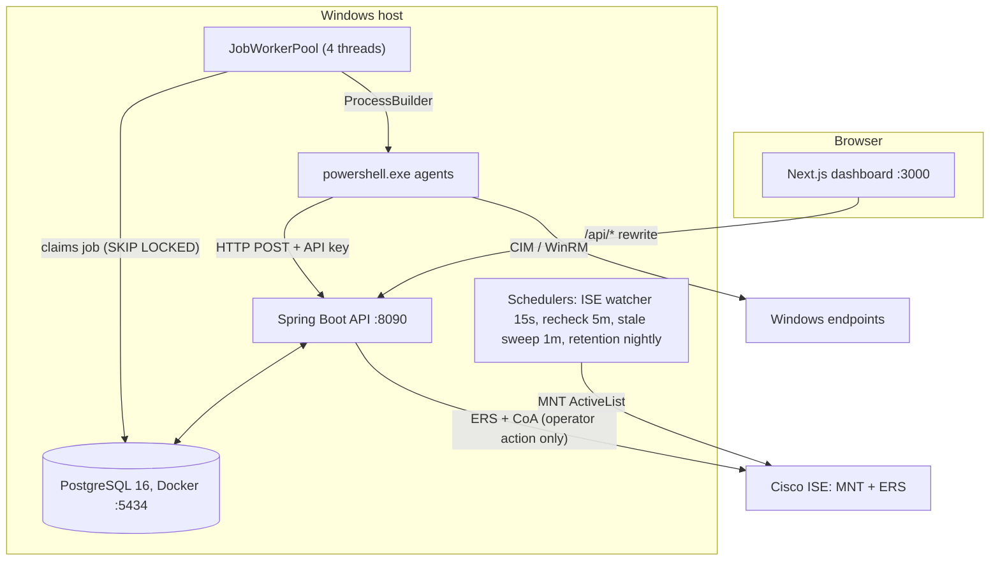

# VE Compliance Engine (Endpoint Posture): Complete Project Guide

**Scope:** the whole system, front to back, the runtime flow, and every package.
**Written from:** the source code, October 2026. Where an older document disagrees with the code, the code wins.
**Status:** backend, agents and dashboard are built, including RBAC, application policy, automatic rechecks, system health, login lockout, warranty, on-demand diagnostics, security indicators, metrics and a frontend image. The core path was verified against a real Windows laptop and a real lab Cisco ISE. Scale behaviour has not been measured (see `FEATURE_ROADMAP.md`, section 3).

## Contents

1. What the system is
2. Architecture
3. Technology stack
4. Repository layout
5. End-to-end flows
6. Database
7. Backend packages
8. REST API reference
9. Configuration reference
10. PowerShell agents
11. Frontend
12. Infrastructure, CI and tooling
13. Running the project
14. Security model
15. Known issues and what is left
16. Retired documents
17. Why it is built this way

---

## 1. What the system is

An **agentless endpoint posture and compliance platform** that works alongside **Cisco ISE**.

- Discovers devices by polling ISE for active sessions.
- Checks Windows devices remotely (PowerShell over CIM, DCOM, WSMan or WinRM) with nothing installed on them.
- Stores every result as permanent, append-only history in PostgreSQL.
- Shows results in a web dashboard.
- A person can **share** a device's posture with ISE, **restrict** it, or **clear** a restriction, subject to role.

### The rule everything else obeys

```
OBSERVATION -> EVIDENCE -> HUMAN REVIEW -> OPTIONAL ISE ACTION
```

ISE is the only network-enforcement authority. Recording a result never calls ISE. Share, Restrict and Clear are separate actions in their own controller and service, and each writes an audit row whether it succeeds or fails. This is enforced by class boundaries, not just convention. How bulk sharing at scale fits this rule is recorded in `DECISIONS.md` (D3).

### Two independent facts per device

| Fact | Meaning | Where it lives |
|---|---|---|
| **Connected** | ISE reports an active session for this MAC | `endpoint.connected` |
| **Posture status** | Latest check: `COMPLIANT`, `NON_COMPLIANT`, `ERROR` | newest `assessment` row |

A device can be connected with old posture, or disconnected with a good historical result. The UI never merges them. Dashboard KPIs and pass rates count **connected devices only**; tables list every device with its last known result.

---

## 2. Architecture


```mermaid
flowchart TD
    subgraph Browser
        FE["Next.js dashboard :3000"]
    end
    subgraph Host["Windows host"]
        API["Spring Boot API :8090"]
        POOL["JobWorkerPool (4 threads)"]
        SCHED["Schedulers: ISE watcher 15s, recheck 5m, stale sweep 1m, retention nightly"]
        PS["powershell.exe agents"]
        DB[("PostgreSQL 16, Docker :5434")]
    end
    ISE["Cisco ISE: MNT + ERS"]
    EP["Windows endpoints"]

    FE -- "/api/* rewrite" --> API
    API <--> DB
    SCHED -- "MNT ActiveList" --> ISE
    POOL -- "claims job (SKIP LOCKED)" --> DB
    POOL -- "ProcessBuilder" --> PS
    PS -- "CIM / WinRM" --> EP
    PS -- "HTTP POST + API key" --> API
    API -- "ERS + CoA (operator action only)" --> ISE
```

A modular monolith: one Spring Boot application, no broker, no Redis. The job queue is a PostgreSQL table.

**Two ways to authenticate**

| Caller | Credential | Allowed to |
|---|---|---|
| Dashboard user | `Authorization: Bearer <JWT>` | depends on role (section 14) |
| PowerShell agent | header `X-Posture-Api-Key` | only `POST` to the four ingestion routes: `/posture`, `/hardware-health`, `/diagnostics`, `/security-indicators` |

---

## 3. Technology stack

| Layer | Technology |
|---|---|
| Backend | Java 21, Spring Boot 3.5.16 (web, validation, data-jpa, security, actuator) |
| Persistence | Hibernate/JPA + PostgreSQL 16; `ddl-auto: validate`, Flyway owns the schema |
| Auth | Spring Security + JJWT 0.12.6, HMAC-SHA256 tokens (480 min), BCrypt, `@PreAuthorize` |
| API docs | springdoc-openapi 2.8.15, Swagger UI at `/swagger-ui.html` |
| Metrics | Micrometer + Prometheus registry |
| Build | Maven; surefire and boot plugin force `-Duser.timezone=UTC` |
| Tests | JUnit 5, Mockito, Spring Security Test, Testcontainers 1.20.4 (several need Docker) |
| Collectors | PowerShell 5+, CIM, WinRM/DCOM, DPAPI credential |
| Frontend | Next.js 16, React 19, TypeScript, Tailwind 3.4, lucide-react |
| Containers | `postgres:16`, `adminer:4`, frontend image (Next `output: standalone`) |
| CI | GitHub Actions (Ubuntu 24.04, JDK 21, Node 22) |

---

## 4. Repository layout

```
endpoint-posture-java/
├── README.md, DECISIONS.md, FEATURE_ROADMAP.md, ROADMAP.md,
│   PROJECT_COMPLETE_GUIDE.md, HANDOFF.md
├── docker-compose.yml, .gitignore, .github/workflows/ci.yml
├── docs/archive/                 retired design and Python-era documents
├── scripts/                      PowerShell agents run by the backend
│   ├── posture_agent.ps1
│   ├── hardware_health_agent.ps1
│   ├── diagnostic_agent.ps1
│   ├── security_indicator_agent.ps1
│   └── Save-PostureCredential.ps1
├── backend/
│   ├── pom.xml, run.ps1 (RBAC smoke test), start-dev.ps1
│   └── src/
│       ├── main/resources/  application.yml, application-dev.yml (git-ignored), db/migration V1..V17
│       ├── main/java/com/endpointposture/
│       │   config/ security/ endpoint/ job/ posture/ hardware/ ise/ session/
│       │   audit/ inventory/ dashboard/ policy/ system/ warranty/ diagnostic/ indicator/
│       └── test/java/...
└── frontend/
    ├── package.json, Dockerfile, next.config.mjs, tailwind.config.ts
    ├── app/         layout, globals.css, login, (dashboard)/...
    ├── components/  layout, ui, dashboard, endpoints
    └── lib/         api, auth, permissions, session, csv, inventory, hooks, contexts
```

`posture_common_cred.xml` is created at runtime by `Save-PostureCredential.ps1`. It is DPAPI-encrypted, tied to one Windows account, and git-ignored.

---

## 5. End-to-end flows

### 5.1 Discovery
1. `IseSessionWatcher.tick()` runs every 15 s and asks `IseSessionClient` for ISE's MNT ActiveList.
2. The client returns `SessionPoll(ok, sessions, error)`. **A failed poll is not an empty poll.**
3. On failure the watcher records it in `IseLinkHealth` and changes nothing (state is frozen).
4. On success each active MAC goes through `EndpointService.markConnected`. A device that was not connected gets a `CONNECTED` log row and, if it has an IP or hostname, a posture job (`enqueueIfDue`).
5. A connected endpoint missing from `app.ise.disconnect-grace-polls` (default 2) consecutive successful polls is marked disconnected, with a `DISCONNECTED` log row.

### 5.2 Running a check
1. A job is enqueued by the watcher, by `RecheckScheduler`, or by an operator (`POST /api/v1/jobs`; priority 10 manual, 0 automatic).
2. A `JobWorkerPool` thread calls `JobWorker.runOnce()`, which claims the next job with `FOR UPDATE SKIP LOCKED` and marks it `RUNNING`.
3. The worker starts the matching agent with `powershell.exe -NoProfile -NonInteractive`. Posture jobs also receive the **active application policy** (`-PolicyVersion`, `-RequiredAppsList`, `-BlockedAppsList`, `|`-delimited). The API key goes in the `POSTURE_API_KEY` environment variable, never on the command line.
4. The agent collects, POSTs its report, and prints one `RESULT_JSON:` line.
5. `submitted: true` completes the job. Anything else writes failure evidence (an `ERROR` assessment, a `succeeded=false` hardware row, or a `FAILED` diagnostic/indicator row) and fails the job. Failed jobs return to `QUEUED` with backoff until `max_attempts` (3), then stay `FAILED`.
6. `StaleJobRecoveryScheduler` (startup + every minute) fails jobs left `RUNNING` beyond their type's process timeout plus a margin, writing the same evidence.

Job types: `POSTURE_CHECK`, `HARDWARE_CHECK` (both rechecked automatically), `DIAGNOSTIC_CHECK`, `SECURITY_CHECK` (on demand only).

### 5.3 Ingesting a report
- **Posture:** `PostureIngestService.ingest`, one transaction: upsert endpoint by MAC, update hardware identity, compute overall status (worst of the reported status and every check, by `AssessmentStatus` ordinal), save `assessment` + `check_result`, save one `endpoint_inventory` row.
- **Hardware:** `HardwareIngestService` normalizes PowerShell's single-element-array quirk and scores components; `HardwareHealthService.recordReport` averages the components that apply and assigns a band. The uploaded warranty table overrides the agent's `UNKNOWN`.
- **Diagnostics:** `DiagnosticService.ingest` scores probes with `DiagnosticScorer` (starts at 100, subtracts documented deductions). `WINRM_UNAVAILABLE` is stored as a distinct, non-failing result with a null score.
- **Security indicators:** `SecurityIndicatorService.ingest` hands the sampled connection snapshots to `SecurityIndicatorAnalyzer` (fan-out on admin ports, beaconing by interval regularity, unusual external ports). Findings are labelled "possible" and are evidence only.
- No ingest path calls ISE.

### 5.4 Automatic rechecks
`RecheckScheduler` sweeps every 5 min. For each **connected** endpoint with an IP or hostname, `JobService.enqueueIfDue(id, type, interval, backoff)` queues a job only if none is `QUEUED`/`RUNNING`, the last `COMPLETE` job is older than the interval (posture 4 h, hardware 24 h) and the last job did not `FAIL` within the backoff (6 h). Hardware is queued only after at least one non-`ERROR` posture result. All timing comes from the database, so it survives restarts.

### 5.5 Operator actions
Endpoint page -> `ConfirmDialog` -> `IseActionController` (`/share`, `/restrict`, `/clear`) -> `IseActionService` -> `IseTransport` (`ErsIseTransport`). Exactly one `ise_action_audit` row is written, success or failure. HTTP `200` on success, `502` if ISE failed. Share needs `ADMIN`, `OPERATOR` or `ANALYST`; restrict and clear need `ADMIN` or `OPERATOR`. `GET /ise/actions/state` derives the latest enforcement state per endpoint from the audit trail.

### 5.6 Retention
`InventoryRetentionScheduler` runs nightly (03:30). It keeps full inventory payloads for the newest N runs per endpoint (default 10) and nulls the JSONB columns on older rows. Assessments, check results, hardware, diagnostics and indicator rows are never pruned (evidence). **Jobs are not pruned yet** (see section 15).

### 5.7 Login lockout
`AuthController` always runs one BCrypt check, then refuses unknown, disabled, locked and wrong-password attempts with the same `401` body. After `app.security.login.max-attempts` (5) consecutive wrong passwords for an existing, enabled account, `LoginAttemptService` locks it for `lock-minutes` (5). Attempts while locked are not counted, so a lock cannot be extended. A good login or an admin password reset clears the state.

---

## 6. Database

Schema is owned by Flyway (`backend/src/main/resources/db/migration`). Versions run V1 to V17; **V5 to V7 do not exist** (harmless gap). UUID primary keys and real foreign keys throughout.

| Migration | Table(s) | Purpose |
|---|---|---|
| V1 | `app_user` | login users; `role` is text (`ADMIN`, `OPERATOR`, `ANALYST`, `VIEWER`), `enabled` flag |
| V2 | `endpoint` | device master row; `mac_address` unique business key; connection state; hardware identity |
| V3 | `posture_job` | the queue: type, status, priority, attempts, `next_attempt_at`, error |
| V4 | `assessment`, `check_result` | append-only posture history; `check_result.details` JSONB with GIN index |
| V8 | `hardware_health`, `hardware_recommendation` | scores 0-100 with CHECK constraints, band, raw report JSONB |
| V9 | alters `hardware_health` | scores nullable; adds `succeeded`, `error_message` |
| V10 | `endpoint_session_log` | connect/disconnect events |
| V11 | `ise_action_audit` | one row per Share/Restrict/Clear attempt |
| V12 | `endpoint_inventory` | per-run raw ports, apps, processes, resources (JSONB) |
| V13 | `app_policy`, `app_policy_rule` | versioned required/blocked apps; partial unique index allows one active policy; v1 seeded |
| V14 | alters `app_user` | `failed_attempts`, `locked_until` (lockout) |
| V15 | `warranty_record` | warranty rows from CSV upload, newest per serial wins |
| V16 | `endpoint_diagnostic` | on-demand network diagnostics; status `OK`/`WINRM_UNAVAILABLE`/`FAILED`, nullable score and band, deductions and raw report JSONB |
| V17 | `endpoint_security_indicator` | indicator runs; status, nullable risk level, findings, summary, raw report JSONB |

**Foreign keys.** `ON DELETE CASCADE` where a child is meaningless without its parent. `ON DELETE SET NULL` for `job_id` and `assessment_id` links, so evidence outlives a purged job.

**Users are not foreign keys.** `ise_action_audit.operator`, `app_policy.created_by` and `warranty_record.uploaded_by` store the username as text, so deleting a user keeps history.

**Append-only.** Assessments, check results, hardware, diagnostics, indicators, inventory, session log, warranty rows and audit rows are inserted, never updated (inventory payloads are only nulled by retention). Only `endpoint`, `posture_job`, `app_user` and `app_policy.active` change in place.

**"Nothing measured" is null, never zero.** Battery, hardware failure rows, diagnostic `WINRM_UNAVAILABLE` and indicator failures all store null scores or risk, so an unmeasured device cannot look critically unhealthy or falsely clean.

**Latest-per-endpoint queries** use `SELECT DISTINCT ON (endpoint_id) ... ORDER BY endpoint_id, <time> DESC`.

---

## 7. Backend packages

### `security/`
`SecurityConfig` (stateless chain, method security, seeds one admin on an empty `app_user`), `JwtService`, `JwtAuthFilter` (looks the user up on every request, so **role and `enabled` come from the database, not the token**), `PostureApiKeyFilter` (constant-time key check, only on `POST` to the four ingest paths, fails closed if no key is configured, grants only `ROLE_AGENT`), `AuthController`, `LoginAttemptService`, `UserController`/`UserService` (passwords 12+ chars; no self-demote, self-disable or self-delete; the last enabled admin cannot be removed), `User`, `UserRepository`, `Role`.

### `endpoint/`
`Endpoint`, `EndpointRepository`, `EndpointService` (`normalizeMac`, `upsertByMac`, `updateHardware`, `markConnected`, `markDisconnected`), `EndpointController` (read-only), `EndpointNotFoundException`. `normalizeMac` makes `aa-bb-...` and `AA:BB:...` the same row.

### `job/`
`PostureJob`, `JobType`, `JobStatus`, `PostureJobRepository`, `JobService` (enqueue, claim, complete, fail with backoff = attempt minutes capped at 15, `markFailedIfRunning`, two `enqueueIfDue` overloads), `JobWorker` (builds the command per type, drains stdout on its own thread, kills on timeout, parses the last `RESULT_JSON:` line), `JobWorkerPool`, `RecheckScheduler`, `StaleJobRecoveryScheduler`, `JobQueueMetrics` (Prometheus gauges for queue depth and oldest queued age), `JobController`.

### `posture/`
`Assessment`, `CheckResult`, `AssessmentStatus` (**order matters**: COMPLIANT < NON_COMPLIANT < ERROR), repositories, `AssessmentService` (single write path: `recordAssessment`, `recordFailure`), `PostureIngestService`, `PostureIngestController` (write), `PostureQueryController` and `PostureFleetController` (read), DTOs, `PostureAgentProperties`.

### `hardware/`
`HardwareHealthReport`, `HardwareRecommendation`, `HardwareBand`, `HardwareHealthService` (overall = average of components that apply; bands 85/70/50 are illustrative; "latest" prefers the last successful run and attaches a newer failure as a notice; warranty recomputed live), `HardwareIngestService`, ingest/query/fleet controllers, `HardwareIngestExceptionHandler` (400), scorers (`Cpu`, `Memory`, `Storage`, `Battery`; battery returns `null` for "not applicable"), `HardwareAgentProperties`. `/latest` returns `204` when never checked.

### `diagnostic/`
`EndpointDiagnostic`, repository, `DiagnosticScorer` (deductions: gateway down 40, DNS failed 25, TCP 443 failed 30, internet ping failed 10, plus latency and loss penalties; unreported sections are not penalised), `DiagnosticService` (`ingest`, `recordFailure`; an agent may submit only `OK` or `WINRM_UNAVAILABLE`, `FAILED` is reserved for the worker), ingest and query controllers (`/latest` returns `204` if never run), `DiagnosticAgentProperties`, DTOs.

### `indicator/`
`EndpointSecurityIndicator`, repository, `SecurityIndicatorAnalyzer` (thresholds illustrative; findings are possible indicators only), `SecurityIndicatorService`, ingest and query controllers, `SecurityIndicatorAgentProperties`, DTOs (single-element arrays accepted).

### `warranty/`
`WarrantyRecord`, `WarrantyRecordRepository`, `WarrantyService` (CSV parsing with BOM and quoted-field handling, serial normalization in one place, status `COVERED` / `EXPIRING_SOON` (30 days or fewer) / `EXPIRED`), `WarrantyController` (`GET` any user, `POST /upload` ADMIN), `WarrantyParseException`, `WarrantyUploadResult`.

### `ise/`
`IseTransport`, `ErsIseTransport` (ERS REST; trust-all TLS only when `verify-tls=false`), `IseActionService`, `IseActionController`, `IseActionStateService`/`Controller`, `IseStatusController`, `EnforcementAction`, `IseResult`, `IseProperties` (`ATTRIBUTE` or `ANC`). Under `ATTRIBUTE`, Clear removes nothing; it tells the operator to re-share posture.

### `session/`
`IseSessionClient`, `IseSessionWatcher`, `IseLinkHealth` (down after 2 consecutive failures), `EndpointSessionLog`, repository, `SessionEventType`, `SessionQueryController`.

### `audit/`, `inventory/`, `dashboard/`, `policy/`, `system/`, `config/`
- `audit/`: `IseActionAudit`, repository, `AuditQueryController`. No update or delete path.
- `inventory/`: `EndpointInventory`, repository, `InventoryController` (`/applications`, `/ports`, labelled against the active policy), retention service and scheduler.
- `dashboard/`: `DashboardService` (`summary`, `trend`, `categories`), native-SQL repository, DTOs. Posture counts cover connected endpoints only; `stale` = latest assessment older than 2x the posture interval.
- `policy/`: `AppPolicy`, `AppPolicyRule`, `PolicyService` (patterns trimmed, de-duplicated, no `|` or `"`; an app cannot be both required and blocked), `PolicyController` (`PUT` ADMIN). Editing inserts version N+1 and deactivates the old one; the version is stored in each `APPLICATIONS` check.
- `system/`: `SystemHealthService` (`UP`/`DEGRADED`/`DOWN` from database, ISE poll, worker pool, oldest queued age), controller, DTOs.
- `config/`: `OpenApiConfig`.

---

## 8. REST API reference

Base path `/api/v1`. All routes need a bearer token unless noted.

| Method | Path | Purpose | Who |
|---|---|---|---|
| POST | `/auth/login` | `{token, username, role}` | public |
| GET | `/endpoints`, `/endpoints/{id}` | device list / one device | any user |
| GET | `/endpoints/{id}/posture`, `/posture/latest` | assessment history / newest | any user |
| GET | `/endpoints/{id}/hardware-health`, `/hardware-health/latest` | history / newest good run (`204` if none) | any user |
| GET | `/endpoints/{id}/diagnostics`, `/diagnostics/latest` | history / newest (`204` if none) | any user |
| GET | `/endpoints/{id}/security-indicators`, `/security-indicators/latest` | history / newest (`204` if none) | any user |
| GET | `/endpoints/{id}/sessions` | connect/disconnect history | any user |
| GET | `/posture/latest`, `/hardware-health/latest` | newest per endpoint, whole fleet | any user |
| POST | `/posture`, `/hardware-health`, `/diagnostics`, `/security-indicators` | agent ingestion | agent key or `ADMIN` |
| GET | `/applications`, `/ports` | fleet inventory from latest runs | any user |
| GET | `/jobs`, `/jobs/endpoint/{id}` | list jobs | any user |
| POST | `/jobs` | enqueue any of the four job types (default priority 10) | `ADMIN`, `OPERATOR`, `ANALYST` |
| POST | `/ise/posture/share` | share posture, audited | `ADMIN`, `OPERATOR`, `ANALYST` |
| POST | `/ise/enforcement/restrict`, `/clear` | restrict / clear, audited | `ADMIN`, `OPERATOR` |
| GET | `/ise/status` | poll health, poll interval, enforcement mode | any user |
| GET | `/ise/actions/state` | latest RESTRICT/CLEAR per endpoint | any user |
| GET | `/audit/ise-actions?endpointId=` | audit trail | any user |
| GET | `/dashboard/summary`, `/trend?days=1..90`, `/categories` | dashboard numbers | any user |
| GET | `/policy/apps`, `/policy/apps/history` | active policy / versions | any user |
| PUT | `/policy/apps` | new policy version | `ADMIN` |
| GET | `/warranty` | warranty rows, newest first | any user |
| POST | `/warranty/upload` | CSV upload (multipart, 10 MB limit) | `ADMIN` |
| GET | `/system/health` | platform health snapshot | any user |
| GET, POST | `/users` | list / create | `ADMIN` |
| PATCH | `/users/{id}` | role and/or enabled | `ADMIN` |
| POST | `/users/{id}/password` | reset password (`204`) | `ADMIN` |
| DELETE | `/users/{id}` | delete (`204`) | `ADMIN` |
| GET | `/actuator/health` | liveness | public |
| GET | `/actuator/prometheus` | metrics | `ADMIN` |

Errors: `400` validation, `401` bad or missing credentials, `403` wrong role, `404` unknown id, `409` last-admin rule, `502` ISE call failed.

---

## 9. Configuration reference

`application.yml` holds structure and safe defaults. **Secrets have no default**, so the app refuses to start without them. `application-dev.yml` (git-ignored) supplies dev values via `start-dev.ps1`.

| Key | Default | Meaning |
|---|---|---|
| `server.port` | 8090 | |
| `spring.datasource.*` | `localhost:5434`, `ep_app` | `DB_URL`, `DB_USERNAME`, `DB_PASSWORD` (password required) |
| `spring.servlet.multipart.max-file-size` | 10MB | warranty CSV |
| `app.jwt.secret` | none | `JWT_SECRET`, at least 32 bytes |
| `app.jwt.expiration-minutes` | 480 | |
| `app.seed-admin.username/password` | `admin` / none | `SEED_ADMIN_USER`, `SEED_ADMIN_PASSWORD` |
| `app.security.login.max-attempts` / `lock-minutes` | 5 / 5 | sits directly under `app.security`, not under `app.jobs` |
| `app.jobs.poll-interval-ms` | 3000 | idle sleep per worker thread |
| `app.jobs.worker-threads` | 4 | each job starts a `powershell.exe` |
| `app.jobs.workers.enabled` | true | false disables the pool |
| `app.jobs.stale-sweep-interval-ms` / `stale-margin-seconds` | 60000 / 60 | stale recovery |
| `app.jobs.recheck.enabled` | true | |
| `app.jobs.recheck.posture-hours` / `hardware-hours` | 4 / 24 | |
| `app.jobs.recheck.failure-backoff-hours` / `sweep-interval-ms` | 6 / 300000 | |
| `app.ise.base-url`, `username`, `password` | blank | blank disables ISE features safely |
| `app.ise.verify-tls` | false | lab only |
| `app.ise.session-poll-interval-ms` | 15000 | |
| `app.ise.disconnect-grace-polls` | 2 | |
| `app.ise.enforcement-mode` | `ATTRIBUTE` | or `ANC` |
| `app.ise.anc-policy-name` | `Quarantine` | unconfirmed against real ISE |
| `app.posture.*` | script `../scripts/posture_agent.ps1`, `api-key` (no default), timeouts 30/15/60 s | cim / server / process |
| `app.hardware.*` | timeouts 30/20/70 s | |
| `app.diagnostics.*` | WinRM open 20 / operation 70 / submit 20 / process 130 s; `dns-test-name`, `internet-target` | |
| `app.security-indicators.*` | WinRM 20/100, submit 20, process 170 s; `sample-count` 12, `sample-interval-seconds` 5 | operation timeout must exceed (count-1) x interval |
| `app.retention.enabled` / `inventory-keep-runs` / `inventory-cron` | true / 10 / `0 30 3 * * *` | |

For every agent, the outer process timeout must exceed the inner timeouts so the agent can report a real error before it is killed.

---

## 10. PowerShell agents

All four collectors share one contract: remote targets use the stored common credential (re-qualified to `TARGET\user` per device), local-vs-remote is decided by comparing `-ComputerName` to the computer name **and** the machine's IPs, the key comes from `POSTURE_API_KEY`, and one `RESULT_JSON:` line is always printed.

- **`posture_agent.ps1`**: OS, IP/MAC, hardware identity, CPU/memory, top processes, firewall profiles, listening ports (raw `TcpClient` probe, 400 ms), installed applications (local registry; remotely `StdRegProv`, then WinRM fallback; unreadable inventory gives `ERROR`, never a false `NON_COMPLIANT`). Policy lists from `-PolicyVersion` are authoritative. Overall status is the worst check. Remote: DCOM first, WSMan fallback, explicit operation timeout.
- **`hardware_health_agent.ps1`**: identity, CPU/memory, `Get-PhysicalDisk`, battery design vs full capacity, 7-day hardware events, recommendations. Warranty is reported `UNKNOWN`; the backend fills it from the uploaded CSV.
- **`diagnostic_agent.ps1`**: runs ON the endpoint through `Invoke-Command` (gateway ping, DNS, internet ping, TCP 443, traceroute). If WinRM cannot be reached it submits `WINRM_UNAVAILABLE`. Workgroup machines reached by IP need the host's WinRM `TrustedHosts` set.
- **`security_indicator_agent.ps1`**: samples established TCP connections on the endpoint several times and submits raw snapshots. Detection happens in the backend.
- **`Save-PostureCredential.ps1`**: one-time DPAPI credential setup; run it as the account that runs the backend. Warns about IP-scoped usernames.

---

## 11. Frontend

Next.js App Router. `next.config.mjs` proxies `/api/*` to `BACKEND_URL` (default `http://localhost:8090`; baked at build time for the container). The JWT lives in `sessionStorage`; `401` clears it and redirects to `/login`; `403` shows "Your role does not allow this action". `request()` shows the server's `message`, and returns `null` for `204`.

| Route | Purpose |
|---|---|
| `/login` | sign in |
| `/overview` | Command Center: KPIs, gauge, donut, 7-day trend, live endpoints, needs-attention, recent ISE actions |
| `/endpoints` | directory, expandable rows, pagination, CSV |
| `/endpoints/[id]` | tabs: Security Posture, Hardware Health (with trend), Diagnostics, Security Indicators, Sessions, Job Queue, ISE Audit; Share/Restrict/Clear behind `ConfirmDialog`; buttons disabled by role |
| `/compliance` | matrix and pass rates |
| `/hardware` | hardware telemetry table |
| `/applications`, `/ports`, `/warranty` | inventory tables; warranty has admin CSV upload |
| `/jobs` | assessment queue, 4 s sync, enqueue modal (four job types) |
| `/policies` | view and edit the application policy, version history |
| `/audit` | ISE action audit |
| `/ise-actions` | fleet enforcement state (in `ATTRIBUTE` mode the UI says "clear requested", never "unrestricted") |
| `/system` | platform health, 10 s poll |
| `/users` | user management (admin) |

`lib/permissions.ts` maps actions (`enqueue`, `sharePosture`, `restrict`, `editPolicy`, `manageUsers`, `uploadWarranty`) to roles. That is UI convenience only; the backend rules are the control. Shared pieces: `DataTable` (pagination + CSV; cells starting with `= + - @` are neutralised), `StatusBadge`, `ConnectionDot`, `IseBanner`, `TrendChart`, `useCachedFetch`, `usePolling`, `IseStatusContext`. The theme is a `theme` cookie read on the server. The dashboard layout validates the token before rendering any page.

---

## 12. Infrastructure, CI and tooling

- `docker-compose.yml`: `postgres:16` (host port 5434), `adminer` (8081), an optional `frontend` service built from `frontend/Dockerfile` that reaches the host backend via `host.docker.internal`.
- `.github/workflows/ci.yml`: backend `mvn -B clean verify` against a Postgres service with test secrets; frontend `npm ci`, `tsc --noEmit`, `npm run build`. It does **not** build or push images.
- Tests (`backend/src/test`): scorers and bands, status ordering, MAC normalization, JWT service and filter, API-key filter, lockout (unit and integration), user rules, watcher grace logic, `enqueueIfDue`, job state, recheck scheduler, stale recovery, policy service, system health rules, dashboard summary and trend, inventory labelling, hardware ingest and report, warranty parsing, diagnostics service and scorer, indicator analyzer and service, ISE action audit rule, ISE action state, `RESULT_JSON` parsing, config binding, and Testcontainers tests for concurrent job claims, inventory retention and role-based access (`RbacAccessTest`). **No frontend tests. Nothing covers `ErsIseTransport` or the `IseSessionClient` XML parsing.**
- `backend/run.ps1`: manual RBAC smoke script. Fill in its placeholders first. It skips Restrict on purpose because that really quarantines the device.

---

## 13. Running the project

```powershell
docker compose up -d                       # Postgres + Adminer
.\scripts\Save-PostureCredential.ps1       # one time
cd backend ; .\start-dev.ps1               # API :8090
cd ..\frontend ; npm install ; npm run dev # http://localhost:3000

cd backend  ; mvn test                     # needs Docker for Testcontainers
cd frontend ; npx tsc --noEmit
```

Without the dev profile set `JWT_SECRET`, `SEED_ADMIN_PASSWORD`, `POSTURE_API_KEY`, `DB_PASSWORD` (and `ISE_BASE_URL`, `ISE_USERNAME`, `ISE_PASSWORD` if ISE is used). After large frontend changes delete `frontend/.next`. Clear the `theme` cookie to reset the theme.

---

## 14. Security model

| Action | ADMIN | OPERATOR | ANALYST | VIEWER |
|---|---|---|---|---|
| Read everything | yes | yes | yes | yes |
| Enqueue any check type | yes | yes | yes | no |
| Share posture with ISE | yes | yes | yes | no |
| Restrict / clear | yes | yes | no | no |
| Edit application policy | yes | no | no | no |
| Upload warranty CSV | yes | no | no | no |
| Manage users | yes | no | no | no |
| `/actuator/prometheus` | yes | no | no | no |

The agent key (`ROLE_AGENT`) can only `POST` to the four ingestion routes.

Other controls: role and enabled flag are read from the database on every request; self-lockout is prevented; BCrypt, 12+ character passwords; identical `401` for every login failure; per-account lockout; ISE actions are explicit, confirmed in the UI and audited with the JWT subject; JWTs are signed, not encrypted.

**Not yet done:** per-IP rate limiting (account lockout alone lets anyone lock the admin out), Swagger and `/v3/api-docs` are public, `verify-tls: false` disables ISE certificate validation, the API is plain HTTP, no security headers/CSP, the shared agent key and the shared admin credential are single high-value secrets. See `FEATURE_ROADMAP.md` section 4.

---

## 15. Known issues and what is left

| Item | Detail |
|---|---|
| Unbounded job list | `GET /jobs` returns every job ever and the Jobs page polls it every 4 s. No job retention. |
| N+1 reads | `AssessmentService.toResponse` runs one check query per assessment. |
| Heavy "latest posture" | `latestPostureOrNull` in `api.ts` downloads the whole history to read element 0. |
| Reconnect jobs ignore the interval | The reconnect `enqueueIfDue(id, type)` only checks for pending jobs, so every reconnect queues a check. |
| Unpaginated lists | `/endpoints`, `/posture/latest`, `/hardware-health/latest`, `/jobs` return everything; most pages filter in the browser. |
| Scale-sensitive code | See `FEATURE_ROADMAP.md` section 3 (watcher, dashboard summary, trend query). Unmeasured. |
| Battery score empty on test laptop | `BatteryStaticData` returns "Generic failure" (WMI/driver). Null is correct. |
| Attribute-mode Clear | informational; no UI may imply "unrestricted". |
| Hardware bands, indicator thresholds | 85/70/50 and the analyzer thresholds are illustrative. |
| Backend cannot run in a Linux container | PowerShell, CIM/DCOM, DPAPI. See `DECISIONS.md` (D2). |
| Lab secrets | `application-dev.yml` holds lab ISE credentials; confirm it is not tracked. |
| Small | unused `trend` variable in `DiagnosticsTab`; login hydration warning from form-filler extensions. |

Everything still to do is in `FEATURE_ROADMAP.md`. Application remediation is out of scope.

---

## 16. Retired documents

These are superseded; if they exist, keep them only under `docs/archive/`:

| Document | Why retired |
|---|---|
| `VE_Compliance_Engine_HLD_LLD_Complete.md` | Pre-build design. Table names (`assessments`, `endpoint_apps`...), `initiated_by` FK, and `min()` hardware scoring differ from what was built. |
| `VE_Compliance_Engine_Full_Documentation.md` | Python-era reference. |
| `VE_Backend_Complete_Explainer.md` | Teaching walkthrough written before V12 to V17; its useful reasoning is in section 17. |
| `SYSTEM_OVERVIEW.md` | Merged into `ROADMAP.md`. |
| `CURRENT_PROGRESS_AND_FUTURE_GOALS.md` | Merged into `FEATURE_ROADMAP.md` and `HANDOFF.md`. |

---

## 17. Why it is built this way

- **Database, not files, for the queue.** The Python prototype used flat files with Windows byte locks. A Postgres queue gives transactions, retry columns, and `FOR UPDATE SKIP LOCKED`: concurrent workers get different rows or nothing, never the same job twice.
- **Real foreign keys and Flyway.** The prototype related tables by MAC string only, so a typo created orphan rows silently. Now the database refuses them, and numbered migrations make every environment identical.
- **JSONB for variable shapes.** Agent reports change shape; JSONB with GIN indexes keeps them queryable without a migration per change. Promote a field to a column only when a real query needs it.
- **Failure is evidence.** A check that could not run still leaves a row (`ERROR` assessment, `succeeded=false`, `FAILED`/`WINRM_UNAVAILABLE`), because losing the ability to check a device is itself a fact auditors ask about.
- **Null is not zero.** Unmeasured values stay null so a desktop with no battery, or an unreachable device, is never scored as dead or as clean.
- **Separate ingest and action classes.** Different controllers and services mean "record a result" cannot fall through into "call ISE".
- **Agents stay PowerShell.** Windows CIM/WMI/WinRM logic gains nothing from a Java rewrite; the backend orchestrates, times out and records.
- **Layered timeouts.** Inner CIM/WinRM timeouts are shorter than the outer process kill, so a hung target produces a real error message instead of an opaque timeout.
- **YAGNI on infrastructure.** Redis, Kafka and Kubernetes are added only when a measured problem demands them.
- **DTOs separate from entities.** The API shape does not change when the schema does, and lazy-loading proxies never leak onto the wire.