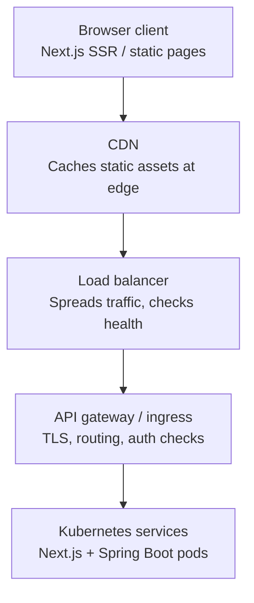
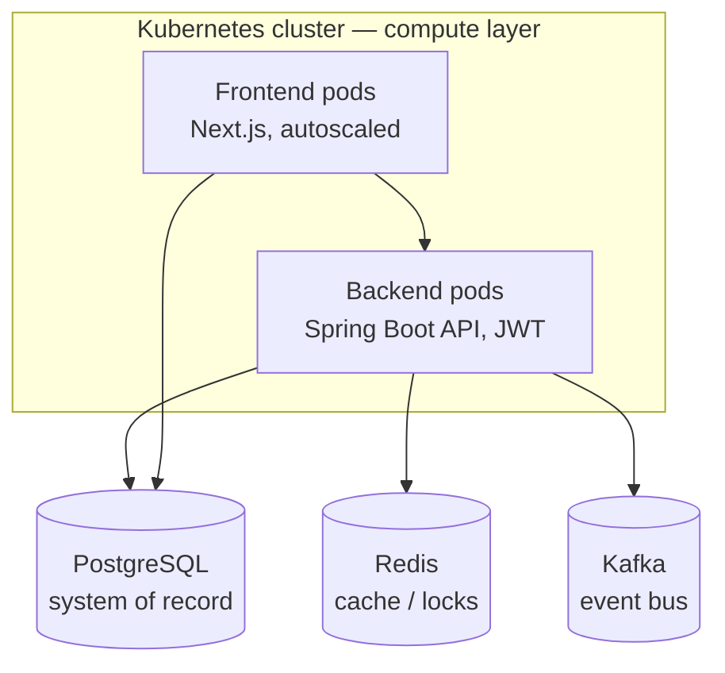
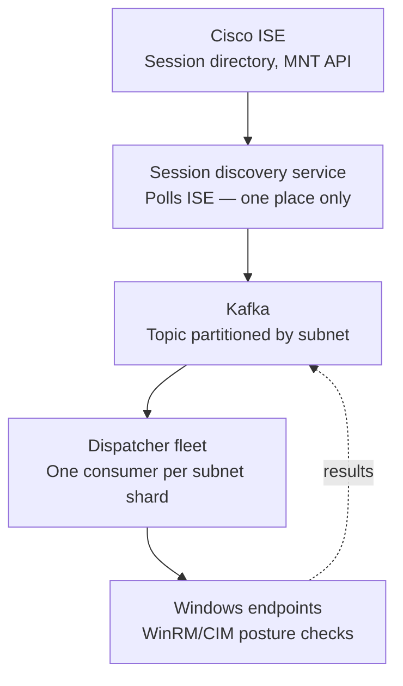
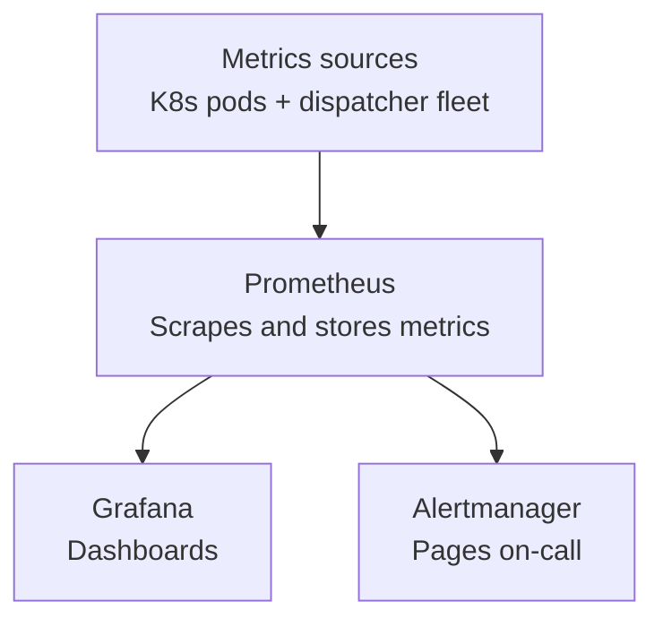
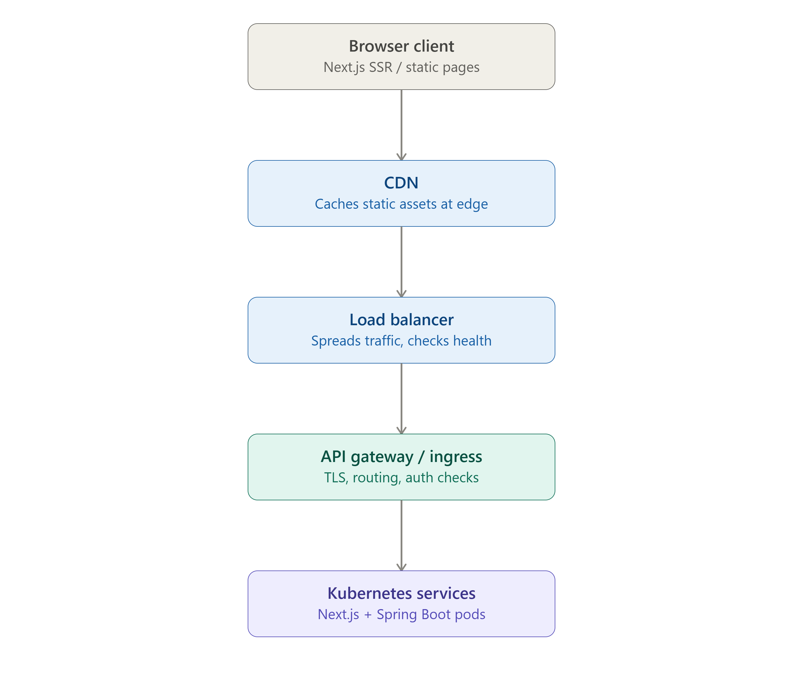
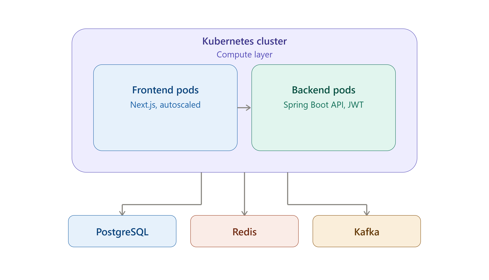
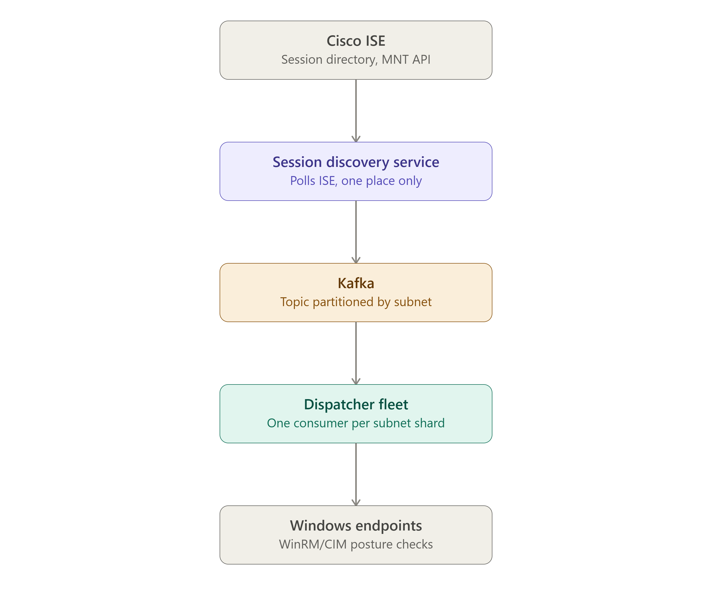
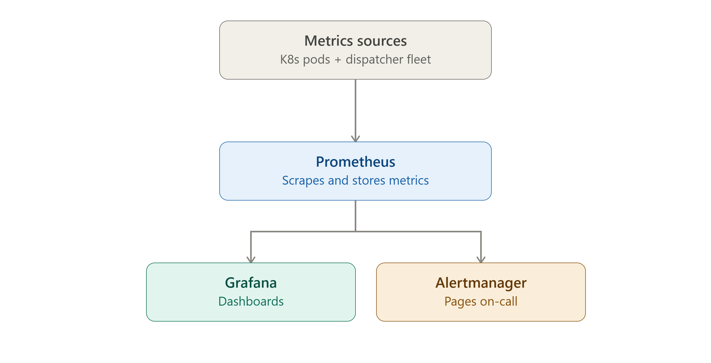
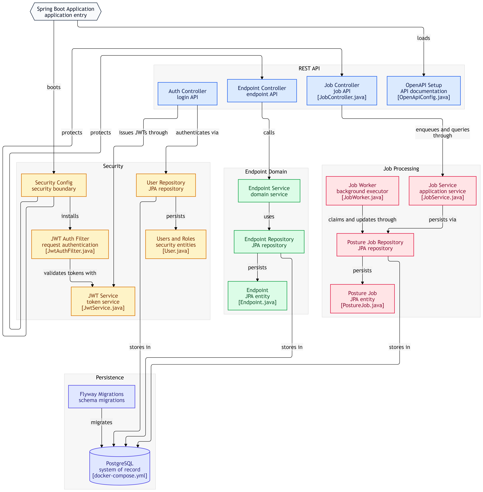

# VE Compliance Engine — Roadmap & Architecture

**A personal project, built solo, on one laptop, with free tools.**

This document is the single source of truth for *why the system is shaped the way it is* and *what order it gets built in*. It combines a phased build roadmap with the architecture behind each phase, so a reader can see both "what's done" and "what it plugs into" in one place.

Status tags used throughout: `✅ Built` · `🚧 Designed, not yet built` · `💤 Deferred`

---

## Table of Contents

1. [What this is](#1-what-this-is)
2. [The two scale numbers, and why they're different problems](#2-the-two-scale-numbers-and-why-theyre-different-problems)
3. [Non-negotiable architectural principle](#3-non-negotiable-architectural-principle)
4. [Tech stack (all free-tier / self-hosted)](#4-tech-stack-all-free-tier--self-hosted)
5. [Architecture — the four runtime diagrams](#5-architecture--the-four-runtime-diagrams)
6. [Architecture — module/component map](#6-architecture--modulecomponent-map)
7. [Phased roadmap (Phase 0 → 9)](#7-phased-roadmap-phase-0--9)
8. [Repository layout (target)](#8-repository-layout-target)
9. [Running it locally](#9-running-it-locally)
10. [Honest constraints of a one-laptop build](#10-honest-constraints-of-a-one-laptop-build)
11. [Appendix — original diagram images](#11-appendix--original-diagram-images)

---

## 1. What this is

An **agentless endpoint posture and compliance visibility platform** that integrates with Cisco ISE. It discovers endpoints via ISE's session directory, runs agentless posture/hardware checks against Windows endpoints over WinRM/CIM, stores every result as permanent history in PostgreSQL, and gives an operator a dashboard to review state and — explicitly, never automatically — share posture with ISE or restrict/clear-restrict a device.

It started as a Python/Flask prototype, is being rebuilt from scratch in Java (Spring Boot) + Next.js with no data migration and no Python code carried forward, and the long-term ambition is a system that could plausibly handle **20,000 concurrent dashboard users** and **50,000 managed endpoints** — even though it is currently developed and run on a single Windows laptop.

## 2. The two scale numbers, and why they're different problems

| Number | What it stresses | What solves it |
|---|---|---|
| **20,000 users** | Concurrent humans hitting the dashboard/API — a normal web-scale problem | Stateless backend pods behind a load balancer, horizontal autoscaling, caching hot reads (Redis) |
| **50,000 endpoints** | Job-queue throughput, DB write volume, and — critically — *how checks actually get dispatched* to that many Windows machines | A single laptop running `ProcessBuilder → powershell.exe` cannot dispatch to 50k endpoints. This is not a Kubernetes problem — it's an architecture problem solved by a **discovery service + Kafka partitioned by subnet + a dispatcher fleet** (§5.3) |

Scaling Kubernetes alone does nothing for the second number if the dispatch model doesn't change. That's why the dispatch-fleet architecture (§5.3) exists as its own diagram, separate from the generic web request path (§5.1).

## 3. Non-negotiable architectural principle

```
OBSERVATION → EVIDENCE → HUMAN REVIEW → OPTIONAL ISE ACTION
```

Cisco ISE remains the sole network-enforcement authority. No module is permitted to call an ISE enforcement operation as a side effect of ingesting a posture result. "Share posture," "Restrict," and "Clear restriction" are three structurally separate, independently audited operator actions — this rule overrides every convenience or performance shortcut anywhere else in this document.

## 4. Tech stack (all free-tier / self-hosted)

| Layer | Choice | Cost |
|---|---|---|
| Backend | Java 21+, Spring Boot 3.3.x, Maven | Free |
| Frontend | Next.js + TypeScript | Free (local dev; Vercel free tier optional for previews) |
| Database | PostgreSQL 16 (Docker) | Free |
| Migrations | Flyway | Free |
| Cache / locks | Redis 7 (Docker) | Free |
| Event bus | Kafka — via Redpanda (lighter, Kafka-API-compatible, easier on a laptop) or Bitnami Kafka image | Free |
| Container runtime | Docker Desktop | Free |
| Orchestration | Kubernetes via `kind` or `minikube` (local) | Free |
| Ingress | ingress-nginx Helm chart | Free |
| Monitoring | kube-prometheus-stack (Prometheus + Grafana + Alertmanager) | Free |
| CI | GitHub Actions | Free tier |
| Image registry | GitHub Container Registry (GHCR) | Free |
| GitOps (optional) | Argo CD, self-hosted in the same cluster | Free |
| Load testing | k6 | Free |

No cloud spend is required to build and demo the entire architecture end-to-end at laptop scale.

## 5. Architecture — the four runtime diagrams

### 5.1 Edge request flow — how a browser request reaches a pod



- **CDN**: caches static Next.js assets at the edge. At laptop scale this step is conceptual (no real CDN in front of `kind`), but the code path (Next.js `standalone` build) doesn't change when one is added later.
- **Load balancer**: pure traffic distribution — doesn't know what an "endpoint" or "user" is, just spreads connections across healthy pods.
- **API gateway / ingress**: `ingress-nginx` does double duty as reverse proxy *and* lightweight gateway (TLS termination, path routing, rate-limit annotations). A heavier gateway (Kong, Apigee) isn't justified at 20k users — Ingress-NGINX covers it.

### 5.2 Compute and data layer — what's inside the cluster



Each data store earns a distinct job — nothing is added for decoration:

| Store | Job | If it dies and comes back empty |
|---|---|---|
| **PostgreSQL** | System of record — endpoints, assessments, jobs, audit. Everything that must never be lost. Flyway-migrated schema. | Unacceptable — this store is never treated as disposable |
| **Redis** | Hot, disposable state: JWT/session helpers, rate-limit counters, "is this endpoint already being checked" locks, cached dashboard summaries | Fine — just re-warms |
| **Kafka** | Decoupling layer — posture-ingestion events fan out to independent consumers (audit writer, ISE sync, future notifications) without the ingestion API waiting on any of them. Also the backbone of the dispatch-fleet design (§5.3) | Consumers replay from offset; no ingestion data is lost since Postgres is still the write-path source of truth |

### 5.3 Dispatch fleet flow — how 50,000 endpoints actually get checked

This is the piece that Kubernetes alone does not solve. It replaces "one laptop shells out to PowerShell" with a shardable pipeline.



- **One discovery service** polls ISE — never multiple machines hammering the ISE API independently.
- **Kafka topic partitioned by subnet** — this is the sharding key. Each dispatcher consumer owns one or more partitions, so no two dispatchers fight over the same subnet.
- **Dispatcher fleet** — at real scale, many Windows worker processes, each doing WinRM/CIM against its own shard of endpoints. At laptop scale (§7, Phase 5), this is simulated with 2–3 separate local consumer processes against however many real lab endpoints exist — same code, same topic design, just fewer workers.
- Results flow back through Kafka (`posture-results` topic) to a backend consumer that writes to Postgres — the ingestion path stays the single-writer, audited path described in the HLD/LLD.

This is the same locality-sharded pattern used for geo-sharded dispatch and regional edge processing at much larger scale — partition by locality, one consumer group per partition.

### 5.4 Observability stack — what watches everything else



- Spring Boot exposes `/actuator/prometheus` via Micrometer.
- `kube-prometheus-stack` installs all three components into the cluster in one Helm release.
- Minimum viable dashboard set: request latency, job-queue depth, DB connection-pool saturation, JVM heap, Kafka consumer lag.
- One Alertmanager rule is enough to prove the pipeline works end-to-end (e.g. *"job queue depth > N for 5 minutes"*) before building out a full on-call policy that, on a personal project, pages no one but yourself.

## 6. Architecture — module/component map

The Spring Boot application itself is a **modular monolith**, not microservices, until a specific felt concurrency/scale problem justifies splitting a module out. The full package structure, entity/repository/service/controller breakdown, database schema (built + designed tables), API contract, sequence diagrams, and class-level designs already live in [`VE_Compliance_Engine_HLD_LLD_Complete.md`](./VE_Compliance_Engine_HLD_LLD_Complete.md) — this roadmap doesn't duplicate that detail, it schedules it.

Quick orientation (see the LLD for the full diagram and rationale):

```
com.endpointposture
├── security/     ✅ Built — JWT auth, User/Role, seeded admin
├── endpoint/     ✅ Built — MAC-keyed upsert, REST read paths
├── job/          ✅ Built — Postgres-backed queue, SKIP LOCKED claim, scheduled worker
├── posture/      🚧 Designed — ingestion, per-check evaluators, assessment history
├── ise/          🚧 Designed — IseTransport interface, ERS implementation, audit
├── hardware/     🚧 Designed — hardware telemetry ingestion + scoring
├── session/      🚧 Designed — ISE session watcher (connect/disconnect)
├── remediation/  💤 Deferred — app classification + remote uninstall
├── endpoint360/  💤 Deferred — experience + security-indicator collectors
└── audit/        🚧 Designed — shared audit-write concern
```

The original module-relationship diagram (entities, repositories, "persists via" / "protects" arrows) is preserved as an image in the appendix (§11) since it mirrors code structure directly rather than a runtime flow.

## 7. Phased roadmap (Phase 0 → 9)

Each phase is independently testable before the next starts. Nothing later is touched until the phase before it is proven working — this is deliberate on a solo, one-laptop build, where debugging four new moving parts at once (as the early Postgres/Flyway/Docker sessions on this project already showed) costs far more time than it saves.

### Phase 0 — Baseline ✅ Done
- [x] PostgreSQL running in Docker (`docker-compose.yml`)
- [x] Flyway migrations `V1` (users/roles) and `V2` (endpoints) applied cleanly
- [x] JWT auth: login, seeded admin, `JwtAuthFilter` protecting all routes except `/auth/**` and health/Swagger
- [x] Endpoint domain: MAC-keyed upsert, `GET /api/v1/endpoints`, `GET /api/v1/endpoints/{id}`
- [x] Job queue: `posture_job` table (`V3`), `SELECT ... FOR UPDATE SKIP LOCKED` claim, scheduled `JobWorker` (stub executor)

*Confirm this still boots clean before adding anything else — don't build on a shaky base.*

### Phase 1 — Finish the backend core 🚧 In progress
Build in this order, each independently testable:
- [ ] `posture/` — PowerShell agent → `POST /api/v1/posture` → per-check evaluators → Postgres. No ISE call anywhere in this path.
- [ ] `session/` — ISE session watcher. **Needs the real ISE lab** — poll MNT ActiveList, mark connect/disconnect, enqueue jobs. Cannot be faked locally.
- [ ] `ise/` — `IseTransport` interface + `ErsIseTransport`, share/restrict/clear as three separate controllers, unconditional audit writes. Also needs real ISE.
- [ ] `hardware/` — same shape as posture, lower priority.

*Free tools needed: none beyond what's already installed (Maven, JDK, Docker Desktop, ISE lab access).*

### Phase 2 — Frontend 🚧 Not started
- [ ] Next.js app: login, endpoint list/detail, posture history, hardware health, ISE action buttons, audit log
- [ ] Consumes the REST API built in Phase 0–1 — no new backend work required to unblock this phase
- [ ] Local `npm run dev` is sufficient; Vercel free tier optional for a hosted preview later

### Phase 3 — Containerize 🚧 Not started
- [ ] Multi-stage `Dockerfile` for Spring Boot (build jar → slim JRE runtime)
- [ ] `Dockerfile` for Next.js (`output: 'standalone'`, not the dev server)
- [ ] Extend `docker-compose.yml` to run backend + frontend + Postgres together as one command — this becomes the dev environment *and* de-risks the later Kubernetes manifests, since the same images run in both

### Phase 4 — Add Redis and Kafka, justified not decorative 🚧 Not started
- [ ] Redis (`redis:7-alpine`): first concrete use — cache the dashboard's endpoint-summary query, or a lock key so `session/` and `job/` never double-trigger a check for the same endpoint
- [ ] Kafka (Redpanda or Bitnami): one topic, `posture-events`, published after a successful ingest, consumed by a simple audit-logger — enough to prove the pattern before leaning on it for dispatch
- [ ] Maps to §5.2 — the data/messaging layer under the compute layer

### Phase 5 — Simulate the dispatcher fleet at lab scale 🚧 Not started
- [ ] Kafka topic `posture-jobs`, partitioned by subnet (3–4 partitions is enough to demonstrate the pattern)
- [ ] Run 2–3 lightweight consumer processes as "dispatcher" instances, each owning a partition, each doing real WinRM against whatever endpoints the lab has
- [ ] This proves the sharding model end-to-end at small scale — same code, same topic design as the 50k-endpoint version, just fewer workers (§5.3)

### Phase 6 — Local Kubernetes 🚧 Not started
- [ ] `kind` or `minikube` instead of a cloud cluster
- [ ] Deployments for backend/frontend; Postgres as an external service or StatefulSet; Helm charts for Redis (Bitnami) and Kafka/Redpanda
- [ ] `ingress-nginx` Helm chart as the gateway (§5.1 becomes real, running locally instead of via a cloud LB)

### Phase 7 — Observability 🚧 Not started
- [ ] `kube-prometheus-stack` Helm chart — installs Prometheus + Grafana + Alertmanager in one shot
- [ ] Micrometer + Actuator on Spring Boot (`/actuator/prometheus`)
- [ ] 2–3 Grafana panels: request latency, job-queue depth, JVM heap
- [ ] One Alertmanager rule to prove the pipeline (e.g. queue depth threshold) — §5.4 running locally

### Phase 8 — CI/CD 🚧 Not started
- [ ] Extend the existing GitHub Actions workflow: run tests → build Docker images → push to GHCR
- [ ] Optional: Argo CD, self-hosted inside the same `kind` cluster, watching the repo for GitOps-style auto-sync — free, zero cloud spend

### Phase 9 — Load test what was actually built 🚧 Not started
- [ ] `k6` scripts hitting the local ingress at whatever concurrency one laptop can push
- [ ] Won't hit real 20k/50k, but will surface real bottlenecks (connection pool size, missing indexes, Kafka consumer lag) that would bite at scale regardless — far cheaper to find here than in production

## 8. Repository layout (target)

```
endpoint-posture-java/
├── backend/                     # Spring Boot (Maven)
│   ├── src/main/java/com/endpointposture/...
│   ├── src/main/resources/db/migration/
│   ├── Dockerfile
│   └── pom.xml
├── frontend/                    # Next.js + TypeScript
│   ├── app/ or pages/
│   └── Dockerfile
├── infra/
│   ├── docker-compose.yml       # local dev: backend + frontend + postgres + redis + kafka
│   ├── k8s/                     # raw manifests or Helm chart, per Phase 6
│   └── helm/                    # Redis, Kafka/Redpanda, ingress-nginx, kube-prometheus-stack values
├── docs/
│   ├── ROADMAP.md               # this file
│   ├── VE_Compliance_Engine_HLD_LLD_Complete.md
│   ├── VE_Compliance_Engine_Full_Documentation.md   # original Python-era reference
│   └── assets/                  # diagram PNGs
├── .github/workflows/           # CI — Phase 8
└── README.md                    # short landing page, links into docs/
```

## 9. Running it locally

*(Fill in as each phase lands — kept short and current rather than aspirational.)*

```bash
# Phase 0–1 (today)
docker compose up -d              # Postgres
cd backend && mvn spring-boot:run # API on :8090, Swagger at /swagger-ui.html

# Phase 3+ (once containerized)
docker compose up -d              # backend + frontend + postgres + redis + kafka, one command

# Phase 6+ (once on Kubernetes)
kind create cluster
helm install ... (ingress-nginx, redis, kafka, kube-prometheus-stack)
kubectl apply -f infra/k8s/
```

## 10. Honest constraints of a one-laptop build

- **ISE-facing modules (`session/`, `ise/`, and any real posture data) only reach the local LAN.** Phases 1 and 5 that touch real posture data are inherently laptop/LAN-bound — that's not a gap in the plan, it's the nature of agentless WinRM/ISE integration. A public demo of this project would show the dashboard/API against seeded or mocked data, not live ISE data, unless the lab network is reachable from wherever the demo runs.
- **Kafka and Kubernetes on a single laptop prove the *pattern*, not the *scale*.** Phase 5's 2–3 simulated dispatchers demonstrate that the subnet-partitioned design works correctly; they do not demonstrate that it holds at 50,000 real endpoints. That claim can only be validated with real load (Phase 9, and ultimately real hardware).
- **No managed cloud services are used**, which keeps cost at zero but means Postgres, Redis, and Kafka are all self-hosted in-cluster rather than managed (RDS/ElastiCache/MSK-equivalent) — acceptable for a personal/demo project, a real production deployment would reconsider this trade-off.

## 11. Appendix — original diagram images

Mermaid versions above are the primary, version-controlled source of truth (they diff cleanly in PRs and need no external tool to view). These PNGs are kept as the original renders for reference.

| Diagram | File |
|---|---|
| Edge request flow | `docs/assets/edge_request_flow.png` |
| Compute and data layer | `docs/assets/compute_and_data_layer.png` |
| Dispatch fleet flow | `docs/assets/dispatch_fleet_flow.png` |
| Observability stack | `docs/assets/observability_stack.png` |
| Module/component map (Spring Boot internals) | `docs/assets/module_diagram.png` |







---

*This roadmap is a living document — update the checkboxes and status tags as each phase actually lands, rather than writing it once and letting it drift from reality.*
