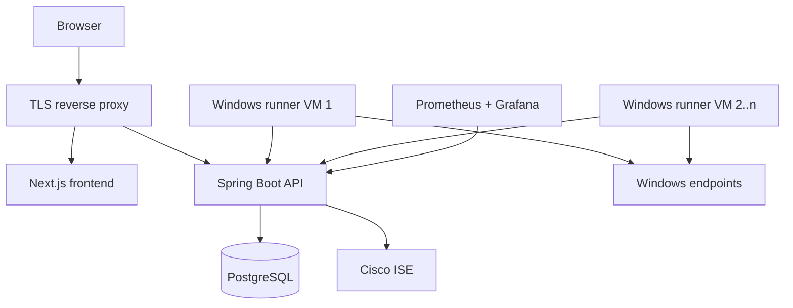

# VE Compliance Engine: System at Completion, Scale and Infrastructure Roadmap

Application features are in `FEATURE_ROADMAP.md`; decisions are in `DECISIONS.md`.

Personal project, built solo, on one machine, with free tools.

---

## 1. Principle

```
OBSERVATION -> EVIDENCE -> HUMAN REVIEW -> OPTIONAL ISE ACTION
```

ISE is the only enforcement authority. Share, Restrict and Clear are separate, audited actions. How standing sharing rules fit is in `DECISIONS.md` D3.

## 2. Where things stand

Built and in use: backend, four PowerShell agents, dashboard, Postgres (V1 to V22), CI (tests, frontend image to GHCR), frontend image, scale simulator, first hardening pass. Not built: backend container, Redis, Kafka, Kubernetes, observability stack, remote runners, paged inventory.

## 3. System at the production target


```mermaid
flowchart TD
    A["Browser"] --> P["TLS reverse proxy"]
    P --> F["Next.js frontend"]
    P --> B["Spring Boot API"]
    B --> DB[("PostgreSQL")]
    R1["Windows runner VM 1"] --> B
    R2["Windows runner VM 2..n"] --> B
    R1 --> EP["Windows endpoints"]
    R2 --> EP
    B --> ISE["Cisco ISE"]
    PROM["Prometheus + Grafana"] --> B
```

Today everything except Postgres and the frontend container runs on one Windows machine (the API and the agents together). The runner VMs are the Option C production shape from `DECISIONS.md` D2. The API calls ISE for sessions and actions; the runners reach the endpoints.

| Zone | Contains |
|---|---|
| Edge | TLS reverse proxy (nginx or Caddy), security headers |
| Compute | Next.js frontend, Spring Boot API |
| Data | PostgreSQL (system of record) |
| Collection | Windows runners executing the PowerShell agents |
| Observability | Prometheus scrape of `/actuator/prometheus`, Grafana |

## 4. Scale: estimates and measurements

Estimates assume a 20 to 30 s average job.

| Load | Calculation | Result |
|---|---|---|
| Steady posture rechecks | 20k live devices / 4 h | about 83 jobs/min (1.4/s) |
| Morning reconnect burst | 20k reconnects over about 2 h | about 170 jobs/min (2.8/s) |
| Concurrent PowerShell processes | rate x duration | about 35 steady, about 70 at peak |
| Default build | 4 threads, about 25 s per job | about 580 jobs/h, roughly 2,300 endpoints on a 4 h cycle |
| Runner fleet | about 20 concurrent per 8-vCPU VM (to be measured) | about 4 to 5 runners at peak |

A job rate near 3 per second is trivial for Postgres with `SKIP LOCKED`. The bottleneck is concurrent PowerShell/WinRM sessions and data volume, not queue throughput, so Kafka is not justified on throughput grounds.

**Measured on the simulator (pre-S12, 20,000 sessions, 50,000 seeded endpoints, 40 simulated workers of about 20 s):**

| Metric | Result |
|---|---|
| Watcher tick (`watcherTickMs`) | 0.5 to 3 s upper bound |
| `dashboardSummary` | 20 to 60 ms |
| `dashboardTrend7` | 20 to 60 ms |
| `endpointsPage25` | 25 to 500 ms |
| Throughput | about 115 jobs/min (40 workers x about 3 jobs/min) |
| Hikari stalls | two: 11:42 (housekeeper delta 1m39s) and 13:00 (1m6s) |

**Post-S12 re-run: PENDING.** Compare against: zero Hikari stalls; endpoint search under 150 ms (trigram indexes); fewer `last_seen_at` writes per tick (`touch-min-minutes`); bounded recheck sweeps (`max-per-sweep`). Run `backend\start-sim.ps1` for 30 to 60 minutes; the GC log is `gc-sim.log`. If a stall lines up with a long GC pause, tune the heap; if not, look at the pool and the database.

Data growth, rough: `assessment` about 120k rows/day (about 44M/year), `check_result` about 130M/year, `posture_job` about 160k/day (30 day retention), `endpoint_session_log` about 40k/day, inventory payloads a few GB/day before the nightly prune.

Known read-path limit: `/applications` and `/ports` return one row per app or port for the whole fleet. They are capped (`app.api.fleet-list-max-endpoints`) until S13 pages them.

Structural risk: an agentless central pull means one shared admin credential reaching up to 20k machines across many subnets. Runners placed per site reduce latency and firewall problems. A push model (a GPO-deployed task that POSTs with a per-device identity) would remove dispatch entirely, but it is a different product trade-off.

## 5. Phased plan

Each phase is independently testable. Do not start the next until the one before is proven.

| Phase | Content | Status |
|---|---|---|
| 0 to 2 | Database, auth, endpoints, queue, posture, hardware, session watcher, ISE actions, audit, frontend | Done |
| 3 | Containerize | Frontend done (image pushed to GHCR from `main`). **Backend deferred** until the deployment model is applied (`DECISIONS.md` D2) |
| 3.5 | `AgentRunner`, `shard`, simulator, fixes from measurements (S5 to S10, S12) | **Done**; post-S12 re-run pending |
| 3.6 | Paged inventory (S13), partitioning (S11) | Next, after the re-run and decision D10 |
| 4 | Redis | Only for a second backend instance or cross-instance rate limiting |
| 5 | Dispatcher fleet (remote runners) | Postgres claims by `shard` first; Kafka only if measurement demands it |
| 6 | Local Kubernetes | After the deployment model is chosen |
| 7 | Observability stack | Metrics endpoint already exists; add Prometheus and Grafana when deploying |
| 8 | CI/CD | Tests, frontend build and frontend image push done; backend image deferred |
| 9 | Load testing | Done by the simulator; repeat after changes |

Triggers for pulling an item forward: Redis when a second API instance exists; Kafka when measured dispatch scale needs it; Kubernetes when the deployment model calls for it.

## 6. Honest constraints of a one-machine build

- ISE-facing code and real endpoint checks only reach the local LAN, so a public demo shows seeded or simulated data.
- Simulation proves the pattern, not the 50k claim; only real hardware proves that.
- Everything is self-hosted, so there is no managed Postgres or cache. Acceptable here; a production deployment should revisit it.