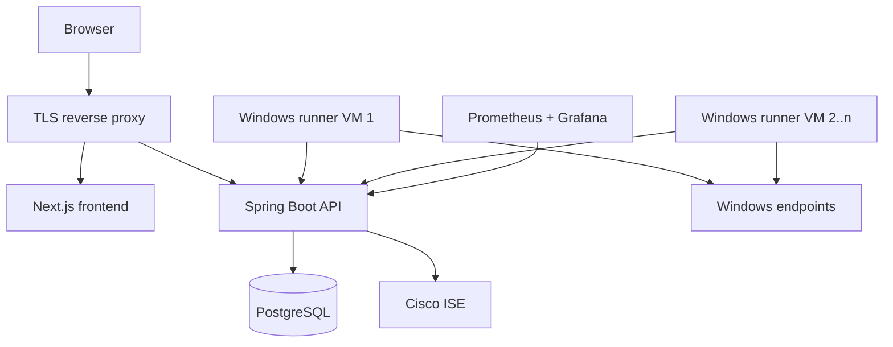

# VE Compliance Engine: System at Completion, Scale and Infrastructure Roadmap

This file replaces `ROADMAP.md` and `SYSTEM_OVERVIEW.md`. Application features are in `FEATURE_ROADMAP.md`; decisions are in `DECISIONS.md`.

Personal project, built solo, on one machine, with free tools.

---

## 1. Principle

```
OBSERVATION -> EVIDENCE -> HUMAN REVIEW -> OPTIONAL ISE ACTION
```

ISE is the only enforcement authority. Share, Restrict and Clear are separate, audited actions. How standing sharing rules fit is in `DECISIONS.md` D3.

## 2. Where things stand

Built and in use: backend, four PowerShell agents, dashboard, Postgres (V1 to V17), CI, frontend image. Not built: backend container, Redis, Kafka, Kubernetes, observability stack, load tests, image publishing.

## 3. System at the production target


```mermaid
flowchart TD
    A["Browser"] --> P["TLS reverse proxy"]
    P --> F["Next.js frontend"]
    P --> B["Spring Boot API"]
    B --> DB[("PostgreSQL")]
    R1["Windows runner VM 1"] --> B
    R2["Windows runner VM 2..n"] --> B
    R1 --> EP["Windows endpoints"]
    R2 --> EP
    B --> ISE["Cisco ISE"]
    PROM["Prometheus + Grafana"] --> B
```

Today everything except Postgres and the frontend container runs on one Windows machine (the API and the agents together). The runner VMs are the Option C production shape from `DECISIONS.md` D2. The API calls ISE for sessions and actions; the runners reach the endpoints.

| Zone | Contains |
|---|---|
| Edge | TLS reverse proxy (nginx or Caddy), security headers |
| Compute | Next.js frontend, Spring Boot API |
| Data | PostgreSQL (system of record) |
| Collection | Windows runners executing the PowerShell agents |
| Observability | Prometheus scrape of `/actuator/prometheus`, Grafana |

## 4. Why one machine is not production: estimates

Estimates, not measurements. Assumes a 20 to 30 s average job (from the 60 to 70 s timeouts and the "10 to 30 seconds" note). Replace with the numbers from the simulator (`FEATURE_ROADMAP.md` S6).

| Load | Calculation | Result |
|---|---|---|
| Steady posture rechecks | 20k live devices / 4 h | about 83 jobs/min (1.4/s) |
| Morning reconnect burst | 20k reconnects over about 2 h | about 170 jobs/min (2.8/s) |
| Concurrent PowerShell processes | rate x duration | about 35 steady, about 70 at peak |
| Current build | 4 threads, about 25 s per job | about 580 jobs/h, roughly 2,300 endpoints on a 4 h cycle |
| Runner fleet | about 20 concurrent per 8-vCPU VM (to be measured) | about 4 to 5 runners at peak |

A job rate near 3 per second is trivial for Postgres with `SKIP LOCKED`. The bottleneck is concurrent PowerShell/WinRM sessions and data volume, not queue throughput, so Kafka is not justified on throughput grounds.

Data growth, rough: `assessment` about 120k rows/day (about 44M/year), `check_result` about 130M/year, `posture_job` about 160k/day, `endpoint_session_log` about 40k/day, inventory payloads a few GB/day before the nightly prune.

Structural risk: an agentless central pull means one shared admin credential reaching up to 20k machines across many subnets. Runners placed per site reduce latency and firewall problems. A push model (a GPO-deployed task that POSTs with a per-device identity) would remove dispatch entirely, but it is a different product trade-off.

## 5. Phased plan

Each phase is independently testable. Do not start the next until the one before is proven.

| Phase | Content | Status |
|---|---|---|
| 0 to 2 | Database, auth, endpoints, queue, posture, hardware, session watcher, ISE actions, audit, frontend | Done |
| 3 | Containerize | Frontend done. **Backend deferred** until the deployment model is applied (`DECISIONS.md` D2) |
| 3.5 | `AgentRunner` refactor, `shard` column, scale simulator, fixes from measurements | **Next** (`FEATURE_ROADMAP.md` S5 to S11) |
| 4 | Redis | Only for a second backend instance or cross-instance rate limiting |
| 5 | Dispatcher fleet (remote runners) | Postgres claims by `shard` first; Kafka only if measurement demands it |
| 6 | Local Kubernetes | After the deployment model is chosen |
| 7 | Observability stack | Metrics endpoint already exists; add Prometheus and Grafana when deploying |
| 8 | CI/CD | Tests and frontend build done; image build and push remaining |
| 9 | Load testing | Folded into the simulator (S6) |

Triggers for pulling an item forward: Redis when a second API instance exists; Kafka when measured dispatch scale needs it; Kubernetes when the deployment model calls for it.

## 6. Honest constraints of a one-machine build

- ISE-facing code and real endpoint checks only reach the local LAN, so a public demo shows seeded or simulated data.
- Simulation proves the pattern, not the 50k claim; only real hardware proves that.
- Everything is self-hosted, so there is no managed Postgres or cache. Acceptable here; a production deployment should revisit it.