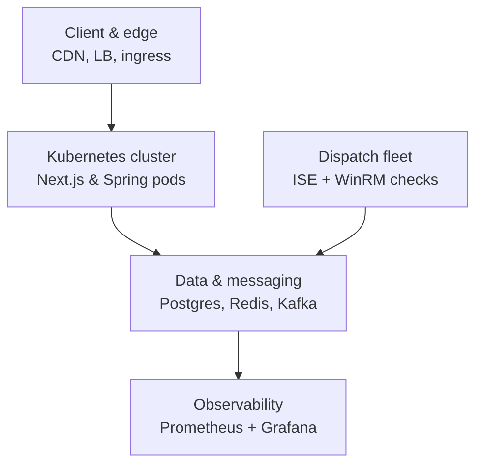
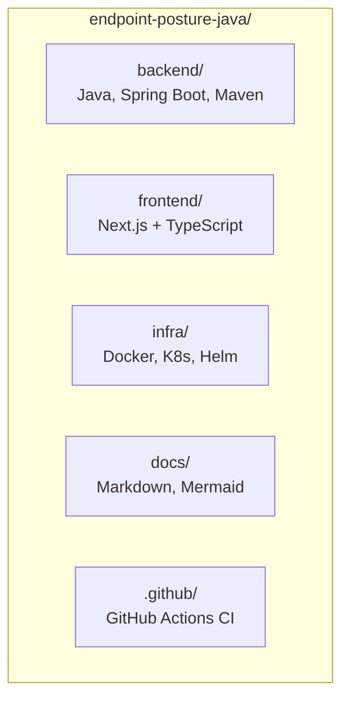

# System Overview

A one-glance view of the complete system at completion, and the repository structure that produces it. For full detail behind each zone - request paths, job-claim concurrency, database schema, API contracts - see [`VE_Compliance_Engine_HLD_LLD_Complete.md`](./VE_Compliance_Engine_HLD_LLD_Complete.md) and the phased build order in [`ROADMAP.md`](./ROADMAP.md).

---

## System at completion

**What each zone is:**

| Zone | Contains | Detail |
|---|---|---|
| Client & edge | CDN, load balancer, ingress/gateway | [`ROADMAP.md` §5.1](./ROADMAP.md#51-edge-request-flow--how-a-browser-request-reaches-a-pod) |
| Kubernetes cluster | Next.js frontend pods, Spring Boot backend pods | [`ROADMAP.md` §5.2](./ROADMAP.md#52-compute-and-data-layer--whats-inside-the-cluster) |
| Data & messaging | PostgreSQL (system of record), Redis (cache/locks), Kafka (event bus) | [`ROADMAP.md` §5.2](./ROADMAP.md#52-compute-and-data-layer--whats-inside-the-cluster) |
| Dispatch fleet | Session discovery service, Kafka partitioned by subnet, dispatcher consumers, WinRM/CIM checks against Windows endpoints | [`ROADMAP.md` §5.3](./ROADMAP.md#53-dispatch-fleet-flow--how-50000-endpoints-actually-get-checked) |
| Observability | Prometheus, Grafana, Alertmanager | [`ROADMAP.md` §5.4](./ROADMAP.md#54-observability-stack--what-watches-everything-else) |

**What's deliberately not shown here:**
- **CI/CD** (GitHub Actions → GHCR → Argo CD) isn't a runtime zone - it *produces* the Kubernetes cluster box above, it doesn't run alongside it at request time. See [`ROADMAP.md` §7, Phase 8](./ROADMAP.md#phase-8--cicd--not-started).
- The **dispatch fleet** box here is a one-box summary of a multi-stage pipeline (discovery service → Kafka topic partitioned by subnet → one dispatcher consumer per shard → endpoints, with results flowing back the same way). Full breakdown in `ROADMAP.md` §5.3.

---

## Repository structure

**What each folder holds:**

| Folder | Tech | Status |
|---|---|---|
| `backend/` | Java 21+, Spring Boot 3.3.x, Maven, PostgreSQL/Flyway, Spring Security + JWT | ✅ Security, endpoint domain, job queue built - `posture/`, `ise/`, `hardware/`, `session/` designed, not yet built |
| `frontend/` | Next.js + TypeScript | 🚧 Not started (Phase 2) |
| `infra/` | Docker Compose, Kubernetes manifests/Helm charts, ingress-nginx, kube-prometheus-stack values | 🚧 Not started (Phases 3, 4, 6, 7) |
| `docs/` | This file, `ROADMAP.md`, the full HLD/LLD, the original Python-era reference doc, diagram assets | ✅ In progress - you're building it now |
| `.github/` | GitHub Actions workflows (test → build → push to GHCR) | 🚧 Not started (Phase 8) |

Full folder-by-folder detail, including the `backend/` package structure down to the class level, is in [`VE_Compliance_Engine_HLD_LLD_Complete.md`](./VE_Compliance_Engine_HLD_LLD_Complete.md) §B.1 and the target repo layout in [`ROADMAP.md`](./ROADMAP.md) §8.

---

*This file is the fast orientation read - two diagrams, no scrolling. Everything here links out to the doc that actually explains it.*
