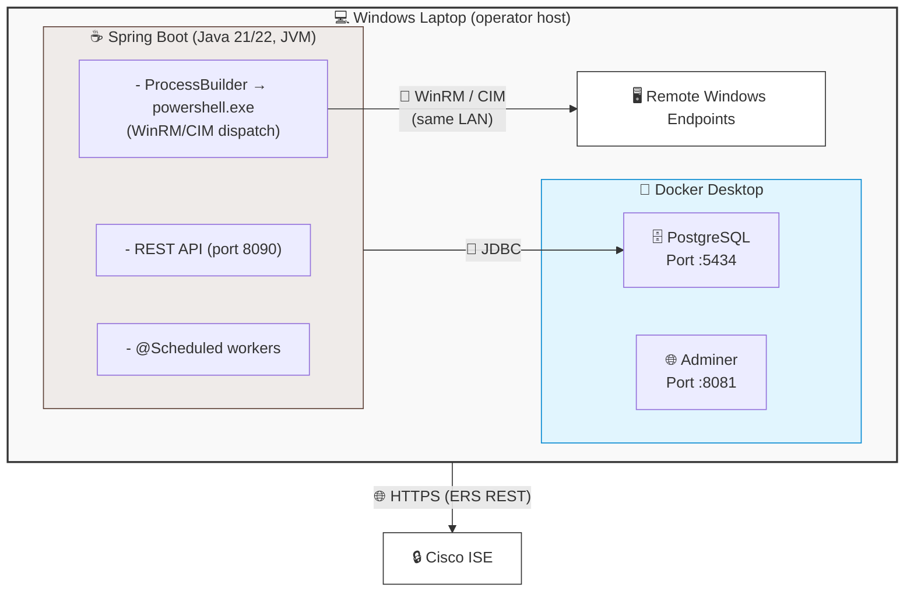
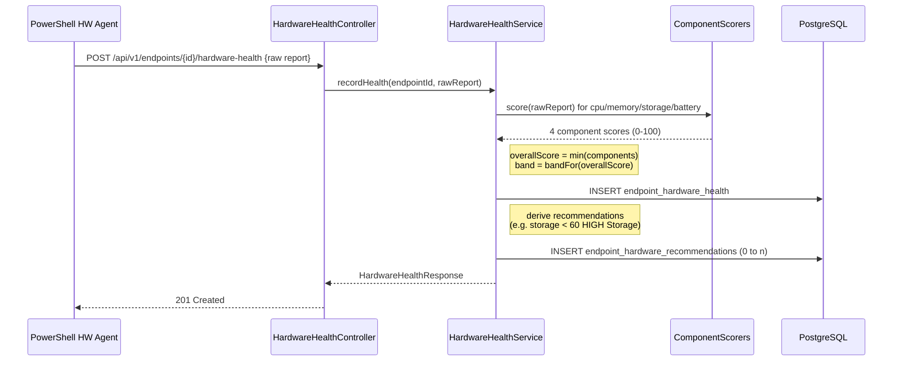
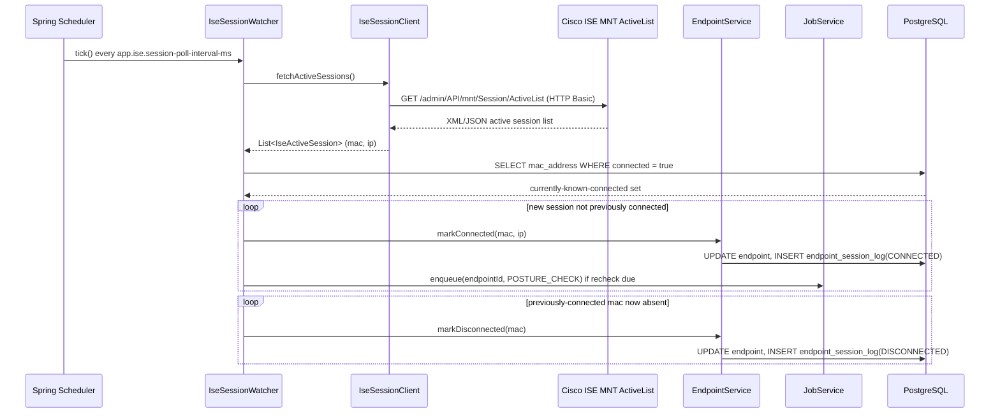

# VE Compliance Engine (Endpoint Posture Java)
## High-Level Design (HLD) & Low-Level Design (LLD) - Completed Edition

**Document scope:** the complete system. This revision closes out every module that was previously marked `🚧 Designed, not yet built` with a full, implementation-ready design - entities, repositories, services, controllers, DTOs, Flyway migrations, and sequence diagrams - so a developer can implement each package directly from this document without further design decisions. Modules marked `💤 Deferred` remain deferred by explicit project decision (see A.3 Non-Goals) and are given only a schema/interface placeholder, not a full build-out, so that no speculative work is done on features not yet in scope.

**Status legend:**
`✅ Built` · `📐 Fully designed (this revision) - ready to implement` · `💤 Deferred (schema reserved, not designed further)`

---

# PART A - HIGH-LEVEL DESIGN (HLD)

## A.1 Purpose and Scope

An **agentless endpoint posture and compliance visibility platform** that integrates with Cisco ISE, running on a single Windows host (the operator's laptop) with WinRM/CIM line-of-sight to endpoints on the same network.

The platform:
- Discovers endpoints connected to the network via Cisco ISE's Session Directory.
- Dispatches posture and hardware-health checks to Windows endpoints, agentlessly, over WinRM/CIM.
- Persists every result as permanent, append-only history in PostgreSQL.
- Exposes a REST API (JWT-secured) for a dashboard to review endpoint state.
- Lets an authenticated operator explicitly decide to share posture with ISE, or restrict/clear-restrict a device - nothing happens automatically.

## A.2 Non-Negotiable Architectural Principle

```
OBSERVATION → EVIDENCE → HUMAN REVIEW → OPTIONAL ISE ACTION
```

Cisco ISE remains the sole network-enforcement authority. No module in this system may call an ISE enforcement operation as a side effect of ingesting a posture result. "Share posture" and "Restrict / Clear restriction" are three structurally separate, independently-audited operator actions. This rule overrides convenience or performance considerations everywhere below, and it is enforced structurally in B.3.2 (separate controllers/service beans, not just a convention).

## A.3 Goals / Non-Goals (unchanged)

**Goals**
- Real foreign keys and Flyway-managed schema from commit #1.
- A modular monolith until a specific, felt concurrency/scale problem justifies splitting.
- Concurrency-safe job processing (no double-run of a posture/hardware check).
- JWT-based authentication from day one; RBAC roles added only when a second role is genuinely enforced differently.
- MAC address as the real business key for every endpoint-identifying operation; UUID as a stable internal/API reference only.

**Non-Goals (for now - still true in this revision)**
- Redis or Kafka.
- Full RBAC with 4 roles.
- A general-purpose configurable policy engine.
- pxGrid integration.
- Browser-history / productivity collection.
- **Remediation and Endpoint 360 remain 💤 deferred in this revision** - they are not "completed" below beyond their reserved schema, because building them out now would be exactly the speculative work the Non-Goals section exists to prevent. They are the next candidates once posture/ISE/hardware/session (all completed below) are running in production.

## A.4 Deployment / Host Model (unchanged)



## A.5 Technology Stack (unchanged, see original doc §A.5)

## A.6 High-Level Module Map - Updated

```
com.endpointposture
├── security/     ✅ Built
├── endpoint/     ✅ Built
├── job/          ✅ Built
├── posture/      📐 Fully designed this revision - ingestion, evaluators, assessment history
├── inventory/    📐 Fully designed this revision - apps/ports/processes
├── ise/          📐 Fully designed this revision - IseTransport, ERS impl, 3 action endpoints
├── hardware/     📐 Fully designed this revision - telemetry + scoring
├── session/      📐 Fully designed this revision - ISE session watcher
├── audit/        📐 Fully designed this revision - shared audit-write concern
├── remediation/  💤 Deferred - schema reserved only (A.3 non-goal)
├── endpoint360/  💤 Deferred - schema reserved only (A.3 non-goal)
└── scheduler/    ✅ Built (job polling) + 📐 session polling designed below
```

## A.7 Core Data Flows - Now Fully Specified

1. **Discovery** (📐): `session/IseSessionWatcher`, a `@Scheduled` task, polls ISE's MNT ActiveList every `app.ise.session-poll-interval-ms`, diffs against `endpoint.connected`, calls `EndpointService.markConnected/markDisconnected`, and enqueues a `POSTURE_CHECK` job for any endpoint due for a recheck (see B.5.6).
2. **Job claim & dispatch** (✅ queue; dispatch itself is Stage 4, out of scope for this revision - this revision completes everything *around* dispatch: what the dispatched agent talks to).
3. **Posture ingestion** (📐): full design in B.4.4 / B.5.4 / B.5.7.
4. **Operator review**: dashboard calls `GET` endpoints (B.3.2) to show current state + history.
5. **Share / Restrict / Clear** (📐): full design in B.4.5 / B.5.1 / B.5.8.
6. **Hardware health** (📐): full design in B.5.9, same job-table mechanism, `job_type = HARDWARE_CHECK`.

## A.8 Non-Functional Requirements (unchanged, see original doc §A.8 - all decisions there are honored in the completed designs below)

---

# PART B - LOW-LEVEL DESIGN (LLD)

## B.1 Package Structure - Completed

```
src/main/java/com/endpointposture/
├── EndpointPostureApplication.java                      ✅
├── security/                                             ✅ (unchanged)
├── endpoint/                                              ✅ (unchanged)
├── job/                                                    ✅ (unchanged)
├── posture/                                                 📐
│   ├── Assessment.java, CheckResult.java
│   ├── AssessmentRepository.java, CheckResultRepository.java
│   ├── PostureIngestController.java   (POST /api/v1/posture)
│   ├── PostureQueryController.java    (GET  /api/v1/endpoints/{id}/posture)
│   ├── PostureService.java
│   ├── AssessmentNotFoundException.java
│   ├── evaluator/
│   │   ├── CheckEvaluator.java
│   │   ├── FirewallCheckEvaluator.java
│   │   ├── PortCheckEvaluator.java
│   │   └── ApplicationCheckEvaluator.java
│   └── dto/
│       ├── PostureReportRequest.java, RawCheckDto.java
│       ├── AssessmentResponse.java, CheckResultResponse.java
├── inventory/                                               📐
│   ├── EndpointApp.java, EndpointPort.java, EndpointProcess.java
│   ├── EndpointAppRepository.java, EndpointPortRepository.java, EndpointProcessRepository.java
│   ├── InventoryService.java
│   └── InventoryController.java (GET .../ports | /applications | /processes)
├── ise/                                                       📐
│   ├── IseTransport.java (interface)
│   ├── ErsIseTransport.java (implementation)
│   ├── IseProperties.java (@ConfigurationProperties app.ise)
│   ├── IseActionController.java (share / restrict / clear - 3 endpoints, own class)
│   ├── IseActionService.java
│   ├── EnforcementAction.java
│   └── dto/ (ShareResult, EnforcementResult, ShareRequest, EnforcementRequest)
├── hardware/                                                   📐
│   ├── HardwareHealthReport.java, HardwareRecommendation.java
│   ├── HardwareHealthRepository.java, HardwareRecommendationRepository.java
│   ├── HardwareHealthController.java, HardwareHealthService.java
│   └── scoring/ (ComponentScorer, CpuScorer, MemoryScorer, StorageScorer, BatteryScorer)
├── session/                                                     📐
│   ├── IseSessionWatcher.java (@Scheduled)
│   ├── IseSessionClient.java (MNT ActiveList HTTP client)
│   └── dto/ (IseActiveSession)
├── audit/                                                        📐
│   ├── IseActionAudit.java
│   ├── IseActionAuditRepository.java
│   └── AuditQueryController.java (GET /api/v1/audit/ise-actions)
├── remediation/                                                    💤 (schema reserved, B.2.2)
└── endpoint360/                                                     💤 (schema reserved, B.2.2)
```

## B.2 Database Schema - Completed

### B.2.1 Already migrated (unchanged): `app_user` (V1), `endpoint` (V2), `posture_job` (V3)

### B.2.2 Flyway migrations to add - full SQL, ready to run in order

**`V4__create_assessments_and_checks.sql`**
```sql
CREATE TABLE assessments (
    id              UUID PRIMARY KEY DEFAULT gen_random_uuid(),
    endpoint_id     UUID NOT NULL REFERENCES endpoint(id),
    collected_at    TIMESTAMPTZ NOT NULL,
    overall_status  TEXT NOT NULL CHECK (overall_status IN ('COMPLIANT','NON_COMPLIANT','ERROR')),
    report_json     JSONB NOT NULL,
    created_at      TIMESTAMPTZ NOT NULL DEFAULT now()
);
CREATE INDEX idx_assessments_endpoint_id   ON assessments(endpoint_id);
CREATE INDEX idx_assessments_collected_at  ON assessments(collected_at);
CREATE INDEX idx_assessments_report_json   ON assessments USING GIN (report_json);

CREATE TABLE check_results (
    id              UUID PRIMARY KEY DEFAULT gen_random_uuid(),
    assessment_id   UUID NOT NULL REFERENCES assessments(id) ON DELETE CASCADE,
    check_type      TEXT NOT NULL,
    status          TEXT NOT NULL CHECK (status IN ('PASS','FAIL','SKIPPED')),
    detail          TEXT
);
CREATE INDEX idx_check_results_assessment_id ON check_results(assessment_id);
```

**`V5__create_inventory_tables.sql`**
```sql
CREATE TABLE endpoint_apps (
    id            UUID PRIMARY KEY DEFAULT gen_random_uuid(),
    endpoint_id   UUID NOT NULL REFERENCES endpoint(id),
    app_name      TEXT NOT NULL,
    version       TEXT,
    collected_at  TIMESTAMPTZ NOT NULL DEFAULT now()
);
CREATE INDEX idx_endpoint_apps_endpoint_id ON endpoint_apps(endpoint_id);

CREATE TABLE endpoint_ports (
    id            UUID PRIMARY KEY DEFAULT gen_random_uuid(),
    endpoint_id   UUID NOT NULL REFERENCES endpoint(id),
    port          INTEGER NOT NULL,
    protocol      TEXT NOT NULL,
    state         TEXT NOT NULL,
    collected_at  TIMESTAMPTZ NOT NULL DEFAULT now()
);
CREATE INDEX idx_endpoint_ports_endpoint_id ON endpoint_ports(endpoint_id);

CREATE TABLE endpoint_processes (
    id            UUID PRIMARY KEY DEFAULT gen_random_uuid(),
    endpoint_id   UUID NOT NULL REFERENCES endpoint(id),
    pid           INTEGER,
    name          TEXT NOT NULL,
    memory_mb     NUMERIC,
    collected_at  TIMESTAMPTZ NOT NULL DEFAULT now()
);
CREATE INDEX idx_endpoint_processes_endpoint_id ON endpoint_processes(endpoint_id);
```

**`V6__create_session_log.sql`**
```sql
CREATE TABLE endpoint_session_log (
    id          UUID PRIMARY KEY DEFAULT gen_random_uuid(),
    endpoint_id UUID NOT NULL REFERENCES endpoint(id),
    event_type  TEXT NOT NULL CHECK (event_type IN ('CONNECTED','DISCONNECTED')),
    event_at    TIMESTAMPTZ NOT NULL DEFAULT now(),
    ip_address  TEXT
);
CREATE INDEX idx_session_log_endpoint_id ON endpoint_session_log(endpoint_id);
CREATE INDEX idx_session_log_event_at    ON endpoint_session_log(event_at);
```

**`V7__create_ise_action_audit.sql`**
```sql
CREATE TABLE ise_action_audit (
    id            UUID PRIMARY KEY DEFAULT gen_random_uuid(),
    endpoint_id   UUID NOT NULL REFERENCES endpoint(id),
    action_type   TEXT NOT NULL CHECK (action_type IN ('SHARE_POSTURE','RESTRICT','CLEAR_RESTRICTION')),
    initiated_by  UUID NOT NULL REFERENCES app_user(id),
    succeeded     BOOLEAN NOT NULL,
    detail        TEXT,
    occurred_at   TIMESTAMPTZ NOT NULL DEFAULT now()
);
CREATE INDEX idx_ise_audit_endpoint_id ON ise_action_audit(endpoint_id);
CREATE INDEX idx_ise_audit_occurred_at ON ise_action_audit(occurred_at);
-- Written unconditionally by IseActionService - success or failure, never skipped.
```

**`V8__create_hardware_health.sql`**
```sql
CREATE TABLE endpoint_hardware_health (
    id             UUID PRIMARY KEY DEFAULT gen_random_uuid(),
    endpoint_id    UUID NOT NULL REFERENCES endpoint(id),
    collected_at   TIMESTAMPTZ NOT NULL DEFAULT now(),
    cpu_score      INTEGER NOT NULL CHECK (cpu_score BETWEEN 0 AND 100),
    memory_score   INTEGER NOT NULL CHECK (memory_score BETWEEN 0 AND 100),
    storage_score  INTEGER NOT NULL CHECK (storage_score BETWEEN 0 AND 100),
    battery_score  INTEGER CHECK (battery_score BETWEEN 0 AND 100), -- nullable: desktops have no battery
    overall_score  INTEGER NOT NULL CHECK (overall_score BETWEEN 0 AND 100),
    overall_band   TEXT NOT NULL CHECK (overall_band IN ('HEALTHY','WARNING','DEGRADED','CRITICAL')),
    raw_report     JSONB NOT NULL
);
CREATE INDEX idx_hw_health_endpoint_id  ON endpoint_hardware_health(endpoint_id);
CREATE INDEX idx_hw_health_collected_at ON endpoint_hardware_health(collected_at);

CREATE TABLE endpoint_hardware_recommendations (
    id                  UUID PRIMARY KEY DEFAULT gen_random_uuid(),
    hardware_health_id  UUID NOT NULL REFERENCES endpoint_hardware_health(id) ON DELETE CASCADE,
    severity            TEXT NOT NULL CHECK (severity IN ('LOW','MEDIUM','HIGH')),
    category            TEXT NOT NULL,
    message             TEXT NOT NULL
);
CREATE INDEX idx_hw_reco_health_id ON endpoint_hardware_recommendations(hardware_health_id);
```

**`V9__reserve_remediation_and_360_schema.sql`** - 💤 tables created but no application code writes to them yet (schema reserved per A.3 non-goal, prevents a later migration-ordering headache without pulling the feature into scope now):
```sql
CREATE TABLE app_classification (
    id        UUID PRIMARY KEY DEFAULT gen_random_uuid(),
    app_key   TEXT NOT NULL UNIQUE,   -- one normalization function, used at every write/read site
    category  TEXT,
    protected BOOLEAN NOT NULL DEFAULT FALSE
);
CREATE TABLE app_uninstall_selection (
    id           UUID PRIMARY KEY DEFAULT gen_random_uuid(),
    endpoint_id  UUID NOT NULL REFERENCES endpoint(id),
    app_key      TEXT NOT NULL REFERENCES app_classification(app_key),
    selected_at  TIMESTAMPTZ NOT NULL DEFAULT now()
);
CREATE TABLE remediation_audit (
    id            UUID PRIMARY KEY DEFAULT gen_random_uuid(),
    endpoint_id   UUID NOT NULL REFERENCES endpoint(id),
    app_key       TEXT,
    initiated_by  UUID NOT NULL REFERENCES app_user(id),
    succeeded     BOOLEAN NOT NULL,
    detail        TEXT,
    occurred_at   TIMESTAMPTZ NOT NULL DEFAULT now()
);
CREATE TABLE endpoint_experience_history (
    id           UUID PRIMARY KEY DEFAULT gen_random_uuid(),
    endpoint_id  UUID NOT NULL REFERENCES endpoint(id),
    collected_at TIMESTAMPTZ NOT NULL DEFAULT now(),
    raw_report   JSONB NOT NULL
);
CREATE TABLE endpoint_security_history (
    id           UUID PRIMARY KEY DEFAULT gen_random_uuid(),
    endpoint_id  UUID NOT NULL REFERENCES endpoint(id),
    collected_at TIMESTAMPTZ NOT NULL DEFAULT now(),
    raw_report   JSONB NOT NULL
);
CREATE TABLE endpoint_360_diagnostics (
    id           UUID PRIMARY KEY DEFAULT gen_random_uuid(),
    endpoint_id  UUID NOT NULL REFERENCES endpoint(id),
    collected_at TIMESTAMPTZ NOT NULL DEFAULT now(),
    summary      TEXT
);
```

### B.2.3 Entity-Relationship Overview (unchanged from original - now fully backed by the migrations above)

## B.3 API Contract - Completed

### B.3.1 Built ✅ (unchanged, see original §B.3.1)

### B.3.2 Now fully specified 📐

| Method | Path | Auth | Purpose |
|---|---|---|---|
| POST | `/api/v1/posture` | Bearer | Ingestion - PowerShell agent → backend. Never touches ISE. |
| GET | `/api/v1/endpoints/{id}/posture` | Bearer | Latest + historical assessments |
| GET | `/api/v1/endpoints/{id}/ports` \| `/applications` \| `/processes` | Bearer | Inventory reads |
| GET | `/api/v1/endpoints/{id}/sessions` | Bearer | Connect/disconnect history |
| POST | `/api/v1/endpoints/{id}/hardware-health` | Bearer | Hardware agent ingestion |
| GET | `/api/v1/endpoints/{id}/hardware-health` | Bearer | Latest + history |
| POST | `/api/v1/ise/posture/share` | Bearer | `IseActionController` - separate class/bean from ingestion |
| POST | `/api/v1/ise/enforcement/restrict` | Bearer | `IseActionController` |
| POST | `/api/v1/ise/enforcement/clear` | Bearer | `IseActionController` |
| GET | `/api/v1/audit/ise-actions` | Bearer | Audit trail read, filterable by `endpointId` |
| GET | `/api/v1/ise/sessions` | Bearer | Raw ISE MNT ActiveList snapshot (debug) |

**Design rule enforced in the controller layer (carried forward as-is):** `PostureIngestController` and `IseActionController` live in different classes, call different service beans (`PostureService` vs `IseActionService`), so "ingest posture" can never fall through into "call ISE" inside one method.

### B.3.3 Sample requests - all designed endpoints

**Posture ingestion** (unchanged from original - see original §B.3.3)

**Hardware health ingestion**
```json
POST /api/v1/endpoints/{id}/hardware-health
{
  "collectedAt": "2026-09-17T10:20:00Z",
  "cpu": { "utilizationPct": 34, "model": "Intel i7-1265U" },
  "memory": { "totalGb": 16, "usedGb": 11.2 },
  "storage": [ { "drive": "C:", "healthStatus": "OK", "freeGb": 42 } ],
  "battery": { "designCapacityMwh": 51000, "fullChargeCapacityMwh": 43000 }
}
```
Response: `201 Created`, persisted `HardwareHealthResponse` (scores + band + recommendations[]).

**Share posture**
```json
POST /api/v1/ise/posture/share
{ "endpointId": "5b1e...e0a1" }
```
Response: `200 OK`
```json
{ "success": true, "detail": "Published to ISE custom attributes" }
```

**Restrict / Clear**
```json
POST /api/v1/ise/enforcement/restrict
{ "endpointId": "5b1e...e0a1", "policy": "Quarantine" }

POST /api/v1/ise/enforcement/clear
{ "endpointId": "5b1e...e0a1" }
```
Both return `200/4xx/5xx` with `{ success, detail }`, and **both write to `ise_action_audit` unconditionally**, even on 5xx.

## B.4 Sequence Diagrams - Completed Set

### B.4.1 / B.4.2 / B.4.3 - unchanged (already ✅ built, see original doc)

### B.4.4 Posture ingestion - unchanged from original (already fully designed there)

### B.4.5 Share posture - unchanged from original (already fully designed there); Restrict/Clear follow the identical shape swapping `publishPosture` for `publishEnforcement`.

### B.4.6 Hardware health ingestion (new - completed this revision)


### B.4.7 ISE session discovery (new - completed this revision)


## B.5 Class-Level Design - Completed

### B.5.1 `IseTransport` (unchanged interface from original, now with the ERS skeleton filled in)
```java
public interface IseTransport {
    IseResult publishPosture(String mac, String status, String details);
    IseResult publishEnforcement(String mac, EnforcementAction action, String policy);
    boolean reachable();
}
public enum EnforcementAction { RESTRICT, CLEAR }
public record IseResult(boolean success, String detail) {}
```

```java
@Component
public class ErsIseTransport implements IseTransport {

    private final RestClient restClient; // built from IseProperties (base-url, basic auth)
    private final IseProperties props;

    public ErsIseTransport(IseProperties props) {
        this.props = props;
        this.restClient = RestClient.builder()
            .baseUrl(props.getBaseUrl())
            .requestInterceptor(new BasicAuthenticationInterceptor(props.getUsername(), props.getPassword()))
            .build();
    }

    @Override
    public IseResult publishPosture(String mac, String status, String details) {
        try {
            restClient.put()
                .uri("/ers/config/endpoint/mac/{mac}", mac)
                .body(Map.of(
                    "ERSEndPoint", Map.of("customAttributes", Map.of(
                        "customAttributes", Map.of(
                            "ExternalComplianceStatus", status,
                            "PostureLastChecked", Instant.now().toString(),
                            "PostureFailedChecks", details))))) // truncate/summarize before sending
                .retrieve()
                .toBodilessEntity();
            return new IseResult(true, "Published posture for " + mac);
        } catch (RestClientException e) {
            return new IseResult(false, e.getMessage());
        }
    }

    @Override
    public IseResult publishEnforcement(String mac, EnforcementAction action, String policy) {
        try {
            if (props.getEnforcementMode() == IseProperties.Mode.ANC) {
                applyAncPolicy(mac, action == EnforcementAction.RESTRICT ? policy : null);
            } else {
                // attribute mode: set a custom attribute, then trigger CoA reauth
                // via the endpoint's active PSN, looked up from MNT session data
                applyAttributeAndReauth(mac, action, policy);
            }
            return new IseResult(true, action + " applied to " + mac);
        } catch (RestClientException e) {
            return new IseResult(false, e.getMessage());
        }
    }

    @Override
    public boolean reachable() {
        try {
            restClient.get().uri("/ers/config/endpoint?size=1").retrieve().toBodilessEntity();
            return true;
        } catch (RestClientException e) {
            return false;
        }
    }

    private void applyAncPolicy(String mac, String policyNameOrNull) { /* ANC apply/clear endpoint calls */ }
    private void applyAttributeAndReauth(String mac, EnforcementAction action, String policy) { /* MNT lookup + CoA */ }
}
```

```java
@ConfigurationProperties(prefix = "app.ise")
public class IseProperties {
    public enum Mode { ATTRIBUTE, ANC }
    private String baseUrl;
    private String username;
    private String password;
    private Mode enforcementMode = Mode.ATTRIBUTE;
    private long sessionPollIntervalMs = 15000;
    // getters/setters
}
```

`IseActionController` (own class per B.3.2 rule) + `IseActionService`:
```java
@RestController
@RequestMapping("/api/v1/ise")
public class IseActionController {
    private final IseActionService service;

    @PostMapping("/posture/share")
    public ResponseEntity<IseResult> share(@RequestBody ShareRequest req, Authentication auth) {
        return ResponseEntity.ok(service.sharePosture(req.endpointId(), auth.getName()));
    }
    @PostMapping("/enforcement/restrict")
    public ResponseEntity<IseResult> restrict(@RequestBody EnforcementRequest req, Authentication auth) {
        return ResponseEntity.ok(service.enforce(req.endpointId(), EnforcementAction.RESTRICT, req.policy(), auth.getName()));
    }
    @PostMapping("/enforcement/clear")
    public ResponseEntity<IseResult> clear(@RequestBody EnforcementRequest req, Authentication auth) {
        return ResponseEntity.ok(service.enforce(req.endpointId(), EnforcementAction.CLEAR, null, auth.getName()));
    }
}

@Service
public class IseActionService {
    private final EndpointRepository endpoints;
    private final PostureService postureService;
    private final IseTransport transport;
    private final IseActionAuditRepository auditRepo;
    private final UserRepository users;

    @Transactional
    public IseResult sharePosture(UUID endpointId, String username) {
        Endpoint ep = endpoints.findById(endpointId).orElseThrow(() -> new EndpointNotFoundException(endpointId.toString()));
        Assessment latest = postureService.getLatestAssessment(endpointId);
        IseResult result = transport.publishPosture(ep.getMacAddress(), latest.getOverallStatus(), summarize(latest));
        writeAudit(ep.getId(), "SHARE_POSTURE", username, result); // unconditional, success or failure
        return result;
    }

    @Transactional
    public IseResult enforce(UUID endpointId, EnforcementAction action, String policy, String username) {
        Endpoint ep = endpoints.findById(endpointId).orElseThrow(() -> new EndpointNotFoundException(endpointId.toString()));
        IseResult result = transport.publishEnforcement(ep.getMacAddress(), action, policy);
        writeAudit(ep.getId(), action == EnforcementAction.RESTRICT ? "RESTRICT" : "CLEAR_RESTRICTION", username, result);
        return result;
    }

    private void writeAudit(UUID endpointId, String actionType, String username, IseResult result) {
        UUID userId = users.findByUsername(username).orElseThrow().getId();
        auditRepo.save(IseActionAudit.builder()
            .endpointId(endpointId).actionType(actionType).initiatedBy(userId)
            .succeeded(result.success()).detail(result.detail()).build());
        // Never allowed to propagate as an unhandled 500 without this row existing first.
    }
}
```

### B.5.2 / B.5.3 Job & Endpoint domain - unchanged (already ✅ built, see original)

### B.5.4 Posture domain - completed
```java
@Entity @Table(name = "assessments")
public class Assessment {
    @Id @GeneratedValue UUID id;
    UUID endpointId;
    Instant collectedAt;
    @Enumerated(EnumType.STRING) OverallStatus overallStatus; // COMPLIANT/NON_COMPLIANT/ERROR
    @JdbcTypeCode(SqlTypes.JSON) String reportJson; // raw payload, stored as JSONB
    Instant createdAt;
    @OneToMany(mappedBy = "assessmentId", cascade = CascadeType.ALL)
    List<CheckResult> checks;
}

@Entity @Table(name = "check_results")
public class CheckResult {
    @Id @GeneratedValue UUID id;
    UUID assessmentId;
    String checkType;   // FIREWALL, PORT, APPLICATION, OS, ...
    @Enumerated(EnumType.STRING) CheckStatus status; // PASS/FAIL/SKIPPED
    String detail;
}

public interface CheckEvaluator {
    boolean supports(String checkType);
    CheckResult evaluate(RawCheckDto input);
}

@Service public class FirewallCheckEvaluator implements CheckEvaluator {
    public boolean supports(String type) { return "FIREWALL".equals(type); }
    public CheckResult evaluate(RawCheckDto in) {
        // agent already reports PASS/FAIL for firewall profile state;
        // evaluator's job here is validation + normalization, not re-deciding policy
        return CheckResult.of("FIREWALL", CheckStatus.valueOf(in.status()), in.detail());
    }
}
@Service public class PortCheckEvaluator implements CheckEvaluator {
    public boolean supports(String type) { return "PORT".equals(type); }
    public CheckResult evaluate(RawCheckDto in) {
        return CheckResult.of("PORT", CheckStatus.valueOf(in.status()), in.detail());
    }
}
@Service public class ApplicationCheckEvaluator implements CheckEvaluator {
    public boolean supports(String type) { return "APPLICATION".equals(type); }
    public CheckResult evaluate(RawCheckDto in) {
        return CheckResult.of("APPLICATION", CheckStatus.valueOf(in.status()), in.detail());
    }
}
// Deliberately not a configurable Policy entity - see A.3 non-goals: generalize only
// once a second, genuinely different policy exists in real use.

@Service
public class PostureService {
    private final AssessmentRepository assessments;
    private final CheckResultRepository checkResults;
    private final EndpointService endpointService;
    private final List<CheckEvaluator> evaluators; // autowired, dispatched by checkType
    private final ObjectMapper objectMapper;

    @Transactional
    public AssessmentResponse recordAssessment(PostureReportRequest req) {
        Endpoint ep = endpointService.upsertByMac(req.macAddress(), null, req.hostname(), req.osName(), req.osVersion());

        Assessment a = new Assessment();
        a.setEndpointId(ep.getId());
        a.setCollectedAt(req.collectedAt());
        a.setReportJson(toJson(req)); // forward-compatible: full raw payload kept

        List<CheckResult> results = req.checks().stream()
            .map(raw -> dispatch(raw))
            .toList();
        a.setOverallStatus(results.stream().anyMatch(r -> r.getStatus() == CheckStatus.FAIL)
            ? OverallStatus.NON_COMPLIANT : OverallStatus.COMPLIANT);

        assessments.save(a);
        results.forEach(r -> { r.setAssessmentId(a.getId()); checkResults.save(r); });

        return toResponse(a, results);
        // No ISE call anywhere in this method - non-negotiable per A.2.
    }

    private CheckResult dispatch(RawCheckDto raw) {
        return evaluators.stream()
            .filter(e -> e.supports(raw.type()))
            .findFirst()
            .map(e -> e.evaluate(raw))
            .orElseGet(() -> CheckResult.of(raw.type(), CheckStatus.SKIPPED, "No evaluator registered for type"));
    }

    @Transactional(readOnly = true)
    public Assessment getLatestAssessment(UUID endpointId) {
        return assessments.findFirstByEndpointIdOrderByCollectedAtDesc(endpointId)
            .orElseThrow(() -> new AssessmentNotFoundException(endpointId));
    }

    @Transactional(readOnly = true)
    public List<AssessmentResponse> history(UUID endpointId) {
        return assessments.findAllByEndpointIdOrderByCollectedAtDesc(endpointId).stream()
            .map(a -> toResponse(a, checkResults.findAllByAssessmentId(a.getId())))
            .toList();
    }
}
```

`PostureIngestController` (own class, per B.3.2) and `PostureQueryController` (separate - read-side, no reason to share a class with the write-side ingestion path):
```java
@RestController
public class PostureIngestController {
    private final PostureService service;
    @PostMapping("/api/v1/posture")
    public ResponseEntity<AssessmentResponse> ingest(@Valid @RequestBody PostureReportRequest req) {
        return ResponseEntity.status(HttpStatus.CREATED).body(service.recordAssessment(req));
    }
}

@RestController
@RequestMapping("/api/v1/endpoints/{id}")
public class PostureQueryController {
    private final PostureService service;
    @GetMapping("/posture")
    public List<AssessmentResponse> posture(@PathVariable UUID id) { return service.history(id); }
}
```

### B.5.5 Inventory domain - completed
```java
@Entity @Table(name = "endpoint_apps")
public class EndpointApp { @Id @GeneratedValue UUID id; UUID endpointId; String appName; String version; Instant collectedAt; }
@Entity @Table(name = "endpoint_ports")
public class EndpointPort { @Id @GeneratedValue UUID id; UUID endpointId; int port; String protocol; String state; Instant collectedAt; }
@Entity @Table(name = "endpoint_processes")
public class EndpointProcess { @Id @GeneratedValue UUID id; UUID endpointId; Integer pid; String name; BigDecimal memoryMb; Instant collectedAt; }

// Repositories: standard findAllByEndpointIdOrderByCollectedAtDesc for each.
// InventoryService.recordFrom(PostureReportRequest) is called by PostureService.recordAssessment
// as a secondary write in the same transaction, so a single POST /api/v1/posture populates
// assessments + check_results + all three inventory tables atomically.

@RestController
@RequestMapping("/api/v1/endpoints/{id}")
public class InventoryController {
    private final InventoryService service;
    @GetMapping("/ports")        public List<EndpointPort> ports(@PathVariable UUID id)        { return service.ports(id); }
    @GetMapping("/applications") public List<EndpointApp> applications(@PathVariable UUID id)   { return service.apps(id); }
    @GetMapping("/processes")    public List<EndpointProcess> processes(@PathVariable UUID id)  { return service.processes(id); }
}
```

### B.5.6 Session domain - completed
```java
@Component
public class IseSessionWatcher {
    private final IseSessionClient client;
    private final EndpointRepository endpoints;
    private final EndpointService endpointService;
    private final JobService jobService;

    @Scheduled(fixedDelayString = "${app.ise.session-poll-interval-ms}")
    public void tick() {
        List<IseActiveSession> active = client.fetchActiveSessions();
        Set<String> activeMacs = active.stream().map(IseActiveSession::mac).collect(toSet());

        for (IseActiveSession s : active) {
            boolean wasConnected = endpoints.findByMacAddress(s.mac()).map(Endpoint::isConnected).orElse(false);
            endpointService.markConnected(s.mac(), s.ip());
            if (!wasConnected) {
                Endpoint ep = endpoints.findByMacAddress(s.mac()).orElseThrow();
                jobService.enqueueIfDue(ep.getId(), JobType.POSTURE_CHECK);
            }
        }

        endpoints.findAllByConnectedTrue().stream()
            .filter(ep -> !activeMacs.contains(ep.getMacAddress()))
            .forEach(ep -> endpointService.markDisconnected(ep.getMacAddress()));
    }
}

@Component
public class IseSessionClient {
    private final RestClient restClient; // HTTP Basic, base URL from IseProperties
    public List<IseActiveSession> fetchActiveSessions() {
        // GET /admin/API/mnt/Session/ActiveList, parse XML response into IseActiveSession(mac, ip)
        // On transport failure: log + return emptyList() so the watcher tick degrades safely
        // rather than throwing and killing the @Scheduled thread for future ticks.
    }
}
public record IseActiveSession(String mac, String ip) {}
```
`EndpointService.markConnected/markDisconnected` also each write one row to `endpoint_session_log` (CONNECTED/DISCONNECTED) - this is the one addition to the already-built `EndpointService` required to support this module; everything else in that service is reused unchanged, per the "never a bare `repository.save()`" rule in B.5.3.

### B.5.7 Audit domain - completed
```java
@Entity @Table(name = "ise_action_audit")
public class IseActionAudit {
    @Id @GeneratedValue UUID id;
    UUID endpointId;
    String actionType;   // SHARE_POSTURE / RESTRICT / CLEAR_RESTRICTION
    UUID initiatedBy;    // FK -> app_user(id), from authenticated principal - never blank
    boolean succeeded;
    String detail;
    Instant occurredAt;
}
public interface IseActionAuditRepository extends JpaRepository<IseActionAudit, UUID> {
    List<IseActionAudit> findAllByEndpointIdOrderByOccurredAtDesc(UUID endpointId);
    List<IseActionAudit> findAllByOrderByOccurredAtDesc();
}

@RestController
@RequestMapping("/api/v1/audit")
public class AuditQueryController {
    private final IseActionAuditRepository repo;
    @GetMapping("/ise-actions")
    public List<IseActionAudit> list(@RequestParam(required = false) UUID endpointId) {
        return endpointId != null
            ? repo.findAllByEndpointIdOrderByOccurredAtDesc(endpointId)
            : repo.findAllByOrderByOccurredAtDesc();
    }
}
```

### B.5.8 Hardware scoring - completed (thresholds still explicitly illustrative, per original doc - not finalized business rules)
```java
public interface ComponentScorer {
    int score(HardwareRawReport report); // 0-100
}
@Component public class CpuScorer implements ComponentScorer {
    public int score(HardwareRawReport r) { return 100 - clamp(r.cpu().utilizationPct(), 0, 100); }
}
@Component public class MemoryScorer implements ComponentScorer {
    public int score(HardwareRawReport r) {
        double usedPct = 100.0 * r.memory().usedGb() / r.memory().totalGb();
        return 100 - (int) clamp(usedPct, 0, 100);
    }
}
@Component public class StorageScorer implements ComponentScorer {
    public int score(HardwareRawReport r) {
        return r.storage().stream().allMatch(d -> "OK".equals(d.healthStatus())) ? 100 : 40;
    }
}
@Component public class BatteryScorer implements ComponentScorer {
    public Integer score(HardwareRawReport r) {
        if (r.battery() == null) return null; // desktops: no battery row at all, not a score of 0
        double wear = 100.0 * r.battery().fullChargeCapacityMwh() / r.battery().designCapacityMwh();
        return (int) clamp(wear, 0, 100);
    }
}

@Service
public class HardwareHealthService {
    private final List<ComponentScorer> scorers; // autowired individually, not via the loop above (battery is nullable)
    private final CpuScorer cpu; private final MemoryScorer memory; private final StorageScorer storage; private final BatteryScorer battery;
    private final HardwareHealthRepository healthRepo;
    private final HardwareRecommendationRepository recoRepo;

    @Transactional
    public HardwareHealthResponse recordHealth(UUID endpointId, HardwareRawReport raw) {
        int cpuScore = cpu.score(raw), memScore = memory.score(raw), stoScore = storage.score(raw);
        Integer batScore = battery.score(raw); // nullable
        int overall = Stream.of(cpuScore, memScore, stoScore, batScore == null ? 100 : batScore)
            .mapToInt(Integer::intValue).min().orElse(0); // min() of components, per original design note
        String band = bandFor(overall); // 85+ HEALTHY, 70-84 WARNING, 50-69 DEGRADED, <50 CRITICAL - ILLUSTRATIVE

        HardwareHealthReport entity = HardwareHealthReport.builder()
            .endpointId(endpointId).cpuScore(cpuScore).memoryScore(memScore)
            .storageScore(stoScore).batteryScore(batScore).overallScore(overall)
            .overallBand(band).rawReport(toJson(raw)).collectedAt(Instant.now()).build();
        healthRepo.save(entity);

        List<HardwareRecommendation> recos = deriveRecommendations(entity);
        recos.forEach(r -> { r.setHardwareHealthId(entity.getId()); recoRepo.save(r); });

        return toResponse(entity, recos);
    }

    private List<HardwareRecommendation> deriveRecommendations(HardwareHealthReport r) {
        List<HardwareRecommendation> out = new ArrayList<>();
        if (r.getStorageScore() < 60) out.add(new HardwareRecommendation("HIGH", "Storage", "Disk health degraded - plan replacement"));
        if (r.getBatteryScore() != null && r.getBatteryScore() < 50) out.add(new HardwareRecommendation("MEDIUM", "Battery", "Battery wear exceeds 50% capacity loss"));
        if (r.getCpuScore() < 40) out.add(new HardwareRecommendation("MEDIUM", "CPU", "Sustained high CPU utilization observed"));
        return out;
    }

    private String bandFor(int score) {
        if (score >= 85) return "HEALTHY";
        if (score >= 70) return "WARNING";
        if (score >= 50) return "DEGRADED";
        return "CRITICAL";
    }
}

@RestController
@RequestMapping("/api/v1/endpoints/{id}/hardware-health")
public class HardwareHealthController {
    private final HardwareHealthService service;
    @PostMapping public ResponseEntity<HardwareHealthResponse> ingest(@PathVariable UUID id, @Valid @RequestBody HardwareRawReport raw) {
        return ResponseEntity.status(HttpStatus.CREATED).body(service.recordHealth(id, raw));
    }
    @GetMapping public List<HardwareHealthResponse> history(@PathVariable UUID id) { return service.history(id); }
}
```

## B.6 Security Design (unchanged, see original §B.6 - already ✅ built and compatible with every module above; every `initiated_by`/`Authentication auth` parameter in the new services above is populated from the existing `JwtAuthFilter`-set `SecurityContext`, no changes required there)

## B.7 Job / Scheduling Design - one addition

| Mechanism | Status |
|---|---|
| `job/JobWorker` - posture/hardware job claim | ✅ Built (Stage 3) |
| `session/IseSessionWatcher` - ISE MNT polling | 📐 Completed this revision (B.5.6) |

`JobService` gains one new method used by `IseSessionWatcher`:
```java
public void enqueueIfDue(UUID endpointId, JobType type) {
    // checks last completed job of this type for this endpoint against the
    // configured recheck interval before enqueueing - prevents the watcher
    // from flooding the queue with a job every 15s for the same endpoint
}
```

## B.8 Conf## B.6 Security Design (unchanged, see original B.6 - already ✅ built and compatible with every module above; every `initiated_by`/`Authentication auth` parameter in the new services above is populated from the existing `JwtAuthFilter`-set `SecurityContext`, no changes required there)
 |
| `app.ise.session-poll-interval-ms` | `IseSessionWatcher` tick rate | `15000` |
| `app.jobs.recheck-interval-hours` | posture recheck cadence used by `enqueueIfDue` | `24` |

## B.9 Error Handling Design - additions

- `AssessmentNotFoundException` → `404`, same pattern as `EndpointNotFoundException`.
- `@Valid` + `@ControllerAdvice` on `PostureIngestController` and `HardwareHealthController` → `400` with field-level messages (now required, since both are live ingestion endpoints).
- `IseSessionClient` transport failures are caught and logged, never thrown into `@Scheduled` - a failed ISE poll skips this tick and retries next interval rather than killing the scheduler thread.
- ISE transport failures in `IseActionService` → non-2xx response **and** an audit row with `succeeded=false`, written before the response is returned (already specified in original §B.9, now backed by concrete code in B.5.1).

## B.10 Testing Strategy - additions

| Layer | Approach |
|---|---|
| `PostureService.recordAssessment` | `@DataJpaTest` (Testcontainers) asserting assessment + check_results + inventory rows all land atomically in one transaction |
| `HardwareHealthService` scoring | Pure unit tests per `ComponentScorer`, plus a table-driven test for `bandFor()` thresholds (flagged illustrative - test documents current behavior, not a locked spec) |
| `IseSessionWatcher` | Unit test with a fake `IseSessionClient` returning a fixed active-session list; assert `markConnected`/`markDisconnected`/`enqueueIfDue` are called exactly once per state transition, never per tick for an unchanged state |
| `IseActionService` | Fake `IseTransport` returning both success and failure; assert an audit row is written in both cases before the method returns |

## B.11 What the Design Explicitly Must Not Lose (unchanged, see original §B.11 - every item is honored by the completed designs above; item 5, PROTECTED_KEYWORDS, remains a requirement for remediation *when that module is eventually taken out of 💤*, not before)

---

*End of completed document. Build order unchanged: posture ingestion → ISE integration → hardware health → session watcher, in that order, each independently testable against the schema in B.2.2 before the next one starts. Remediation and Endpoint 360 stay 💤 until explicitly pulled into scope - this document does not pre-build them.*
